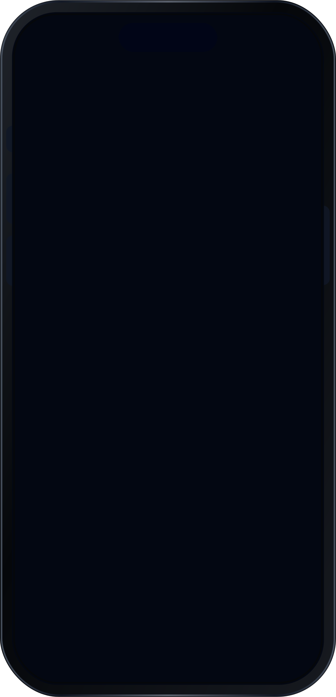

# DSKitExplorer Screens

> Generated by `Scripts/documentation_generator.sh`. Use this page as the table of contents for snapshot-backed DSKitExplorer screens.

## Agent Quick Start

- Start here when you need a concrete screen example rather than a component API reference.
- Scan the preview grid to find the screen pattern you need, then open its dedicated page.
- Each screen page includes source links, snapshot previews, and detected DSKit view references.

## Screen Catalog

### Food

<table>
<tr>
<td align="center" valign="top"> FoodCategoriesScreen1</td>
<td align="center" valign="top"> FoodDetailsScreen1</td>
<td align="center" valign="top"> FoodHomeScreen1</td>
</tr>
<tr>
<td align="center" valign="top"> FoodNearbyRestaurantScreen1</td>
<td align="center" valign="top"> FoodRestaurantScreen1</td>
<td></td>
</tr>
</table>

### Booking

<table>
<tr>
<td align="center" valign="top"> BookingScreen1</td>
<td align="center" valign="top"> BookingScreen2</td>
<td align="center" valign="top"> BookingScreen3</td>
</tr>
<tr>
<td align="center" valign="top"> BookingScreen4</td>
<td align="center" valign="top"> BookingScreen5</td>
<td></td>
</tr>
</table>

### Home

<table>
<tr>
<td align="center" valign="top"> HomeScreen1</td>
<td align="center" valign="top"> HomeScreen2</td>
<td align="center" valign="top"> HomeScreen3</td>
</tr>
<tr>
<td align="center" valign="top"> HomeScreen4</td>
<td></td>
<td></td>
</tr>
</table>

### Gallery

<table>
<tr>
<td align="center" valign="top"> ImageGalleryScreen1</td>
<td align="center" valign="top"> ImageGalleryScreen2</td>
<td></td>
</tr>
</table>

### Authentication

<table>
<tr>
<td align="center" valign="top"> LogInScreen1</td>
<td align="center" valign="top"> LogInScreen2</td>
<td align="center" valign="top"> LogInScreen3</td>
</tr>
<tr>
<td align="center" valign="top"> LogInScreen4</td>
<td align="center" valign="top"> SignUpScreen1</td>
<td align="center" valign="top"> SignUpScreen2</td>
</tr>
<tr>
<td align="center" valign="top"> SignUpScreen3</td>
<td align="center" valign="top"> SignUpScreen4</td>
<td></td>
</tr>
</table>

### Profile

<table>
<tr>
<td align="center" valign="top"> ProfileScreen1</td>
<td align="center" valign="top"> ProfileScreen2</td>
<td align="center" valign="top"> ProfileScreen3</td>
</tr>
</table>

### Commerce

<table>
<tr>
<td align="center" valign="top"> CartScreen1</td>
<td align="center" valign="top"> CartScreen2</td>
<td align="center" valign="top"> CartScreen3</td>
</tr>
<tr>
<td align="center" valign="top"> CartScreen4</td>
<td align="center" valign="top"> CartScreen5</td>
<td align="center" valign="top"> Categories1</td>
</tr>
<tr>
<td align="center" valign="top"> Categories2</td>
<td align="center" valign="top"> Categories3</td>
<td align="center" valign="top"> Categories4</td>
</tr>
<tr>
<td align="center" valign="top"> Categories5</td>
<td align="center" valign="top"> Filters1</td>
<td align="center" valign="top"> Filters2</td>
</tr>
<tr>
<td align="center" valign="top"> Filters3</td>
<td align="center" valign="top"> ItemDetails1</td>
<td align="center" valign="top"> ItemDetails2</td>
</tr>
<tr>
<td align="center" valign="top"> ItemDetails3</td>
<td align="center" valign="top"> ItemDetails4</td>
<td align="center" valign="top"> ItemDetails5</td>
</tr>
<tr>
<td align="center" valign="top"> Items1</td>
<td align="center" valign="top"> Items2</td>
<td align="center" valign="top"> Items3</td>
</tr>
<tr>
<td align="center" valign="top"> Items4</td>
<td align="center" valign="top"> Items5</td>
<td align="center" valign="top"> Items6</td>
</tr>
<tr>
<td align="center" valign="top"> Items7</td>
<td align="center" valign="top"> Items8</td>
<td align="center" valign="top"> Order1</td>
</tr>
<tr>
<td align="center" valign="top"> Order2</td>
<td align="center" valign="top"> Order3</td>
<td align="center" valign="top"> Order4</td>
</tr>
<tr>
<td align="center" valign="top"> Payment1</td>
<td align="center" valign="top"> Payment2</td>
<td align="center" valign="top"> Shipping1</td>
</tr>
<tr>
<td align="center" valign="top"> Shipping2</td>
<td></td>
<td></td>
</tr>
</table>

### News

<table>
<tr>
<td align="center" valign="top"> NewsScreen1</td>
<td align="center" valign="top"> NewsScreen2</td>
<td align="center" valign="top"> NotificationsScreen1</td>
</tr>
</table>

### About

<table>
<tr>
<td align="center" valign="top"> AboutUsScreen1</td>
<td align="center" valign="top"> AboutUsScreen2</td>
<td></td>
</tr>
</table>

### Playgrounds

<table>
<tr>
<td align="center" valign="top"> DesignTokensPlaygroundScreen</td>
<td align="center" valign="top"> DynamicTypePlaygroundScreen</td>
<td></td>
</tr>
</table>

## Maintenance

- Refresh these docs with `cd Scripts && ./documentation_generator.sh`.
- Every screen page must have at least one matching snapshot image in `DSKitExplorerTests/__Snapshots__/DSKitExplorerTests`.
- A screen named `ExampleScreen` uses `ExampleScreen.snapshot.png` and may also include variants such as `ExampleScreen_0.snapshot.png`.
- Framed screen previews are generated SVG files under `Content/Screens/Frames` from the source snapshot PNGs.
