# DSKitExplorer Screens

## Screen Examples

Start here when you need a concrete screen example instead of a component API reference.

Browse the preview strips to find the screen pattern you need, then open the related reference page below it. Each screen page includes source links, snapshot previews, and detected DSKit view references.

## Screen Catalog

### Food

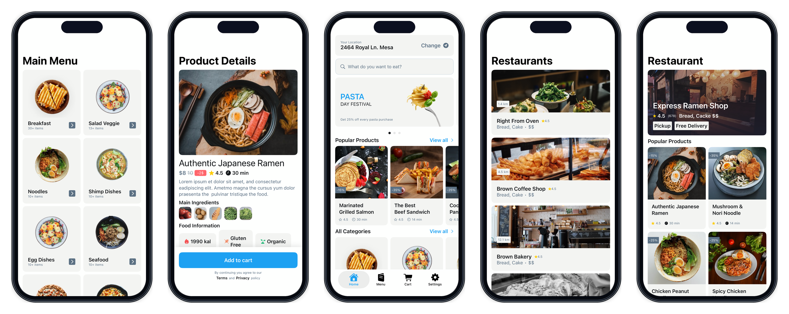

Related screen references: [FoodCategoriesScreen1](Screens/FoodCategoriesScreen1.md), [FoodDetailsScreen1](Screens/FoodDetailsScreen1.md), [FoodHomeScreen1](Screens/FoodHomeScreen1.md), [FoodNearbyRestaurantScreen1](Screens/FoodNearbyRestaurantScreen1.md), [FoodRestaurantScreen1](Screens/FoodRestaurantScreen1.md).

### Booking

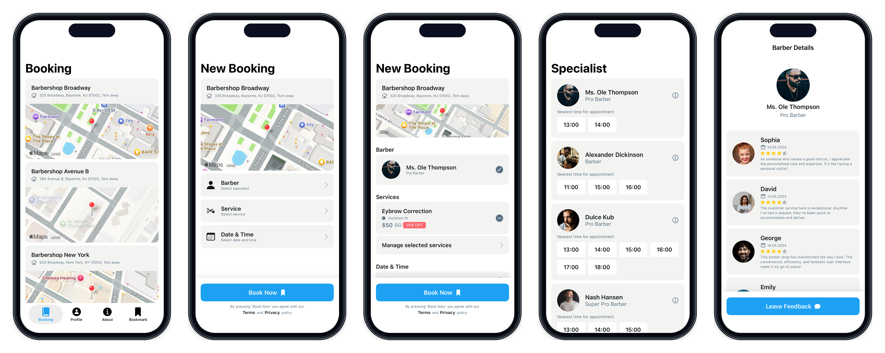

Related screen references: [BookingScreen1](Screens/BookingScreen1.md), [BookingScreen2](Screens/BookingScreen2.md), [BookingScreen3](Screens/BookingScreen3.md), [BookingScreen4](Screens/BookingScreen4.md), [BookingScreen5](Screens/BookingScreen5.md).

### Home

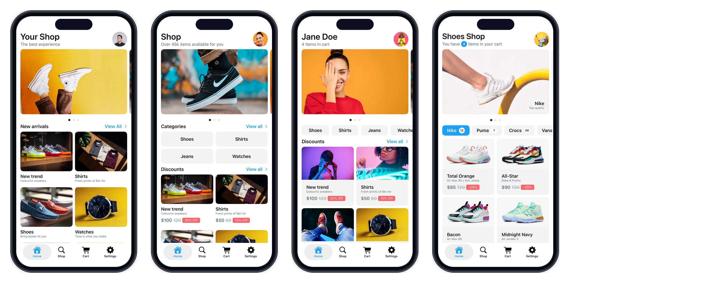

Related screen references: [HomeScreen1](Screens/HomeScreen1.md), [HomeScreen2](Screens/HomeScreen2.md), [HomeScreen3](Screens/HomeScreen3.md), [HomeScreen4](Screens/HomeScreen4.md).

### Gallery

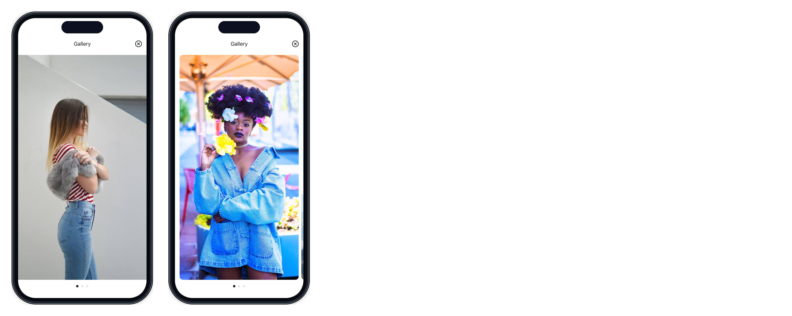

Related screen references: [ImageGalleryScreen1](Screens/ImageGalleryScreen1.md), [ImageGalleryScreen2](Screens/ImageGalleryScreen2.md).

### Authentication

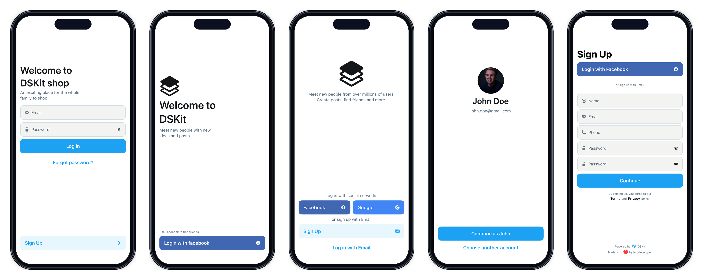

Related screen references: [LogInScreen1](Screens/LogInScreen1.md), [LogInScreen2](Screens/LogInScreen2.md), [LogInScreen3](Screens/LogInScreen3.md), [LogInScreen4](Screens/LogInScreen4.md), [SignUpScreen1](Screens/SignUpScreen1.md), [SignUpScreen2](Screens/SignUpScreen2.md), [SignUpScreen3](Screens/SignUpScreen3.md), [SignUpScreen4](Screens/SignUpScreen4.md).

### Profile

Related screen references: [ProfileScreen1](Screens/ProfileScreen1.md), [ProfileScreen2](Screens/ProfileScreen2.md), [ProfileScreen3](Screens/ProfileScreen3.md).

### Commerce

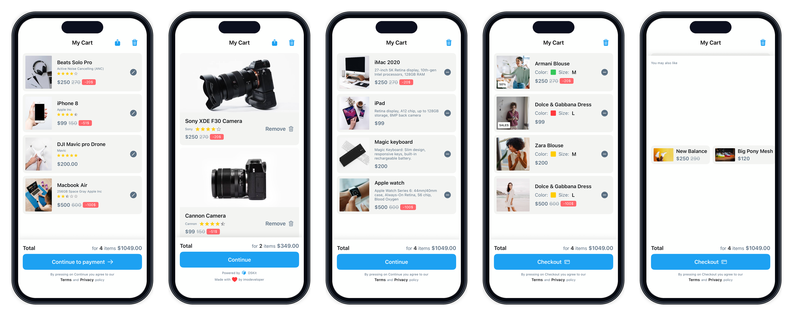

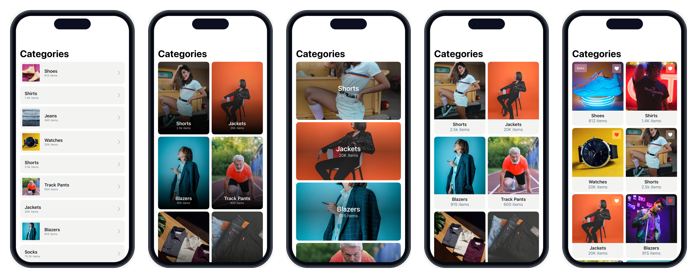

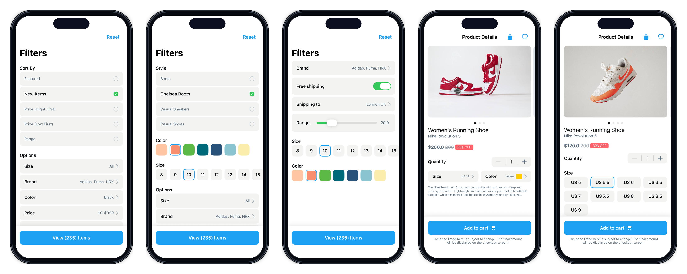

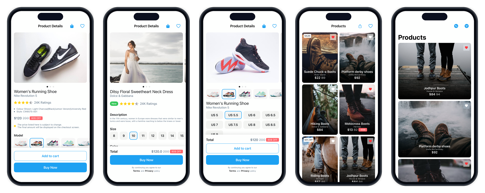

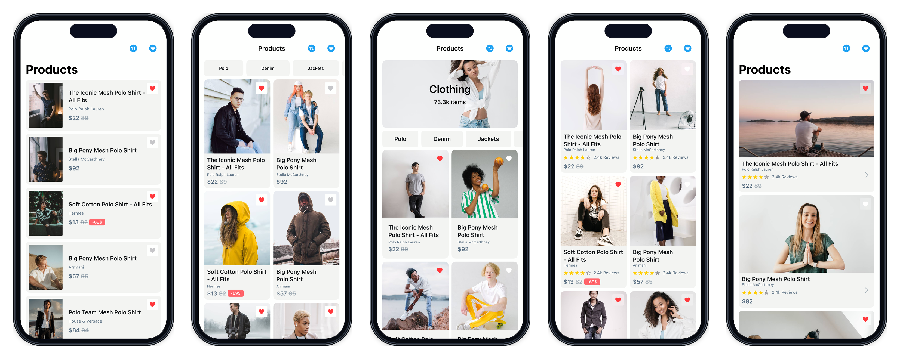

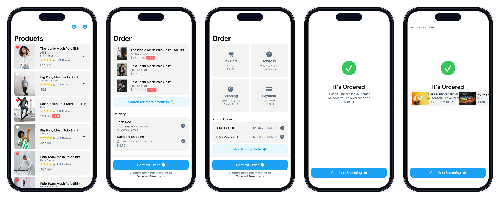

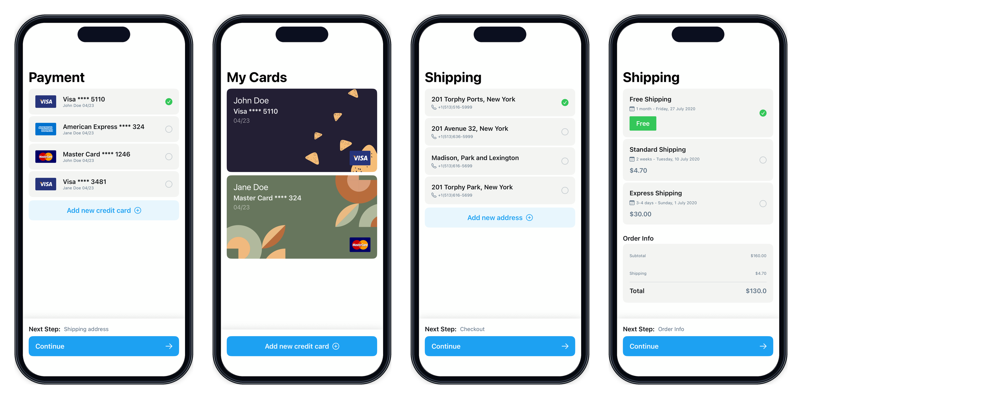

Related screen references: [CartScreen1](Screens/CartScreen1.md), [CartScreen2](Screens/CartScreen2.md), [CartScreen3](Screens/CartScreen3.md), [CartScreen4](Screens/CartScreen4.md), [CartScreen5](Screens/CartScreen5.md), [Categories1](Screens/Categories1.md), [Categories2](Screens/Categories2.md), [Categories3](Screens/Categories3.md), [Categories4](Screens/Categories4.md), [Categories5](Screens/Categories5.md), [Filters1](Screens/Filters1.md), [Filters2](Screens/Filters2.md), [Filters3](Screens/Filters3.md), [ItemDetails1](Screens/ItemDetails1.md), [ItemDetails2](Screens/ItemDetails2.md), [ItemDetails3](Screens/ItemDetails3.md), [ItemDetails4](Screens/ItemDetails4.md), [ItemDetails5](Screens/ItemDetails5.md), [Items1](Screens/Items1.md), [Items2](Screens/Items2.md), [Items3](Screens/Items3.md), [Items4](Screens/Items4.md), [Items5](Screens/Items5.md), [Items6](Screens/Items6.md), [Items7](Screens/Items7.md), [Items8](Screens/Items8.md), [Order1](Screens/Order1.md), [Order2](Screens/Order2.md), [Order3](Screens/Order3.md), [Order4](Screens/Order4.md), [Payment1](Screens/Payment1.md), [Payment2](Screens/Payment2.md), [Shipping1](Screens/Shipping1.md), [Shipping2](Screens/Shipping2.md).

### News

Related screen references: [NewsScreen1](Screens/NewsScreen1.md), [NewsScreen2](Screens/NewsScreen2.md), [NotificationsScreen1](Screens/NotificationsScreen1.md).

### About

Related screen references: [AboutUsScreen1](Screens/AboutUsScreen1.md), [AboutUsScreen2](Screens/AboutUsScreen2.md).

### Playgrounds

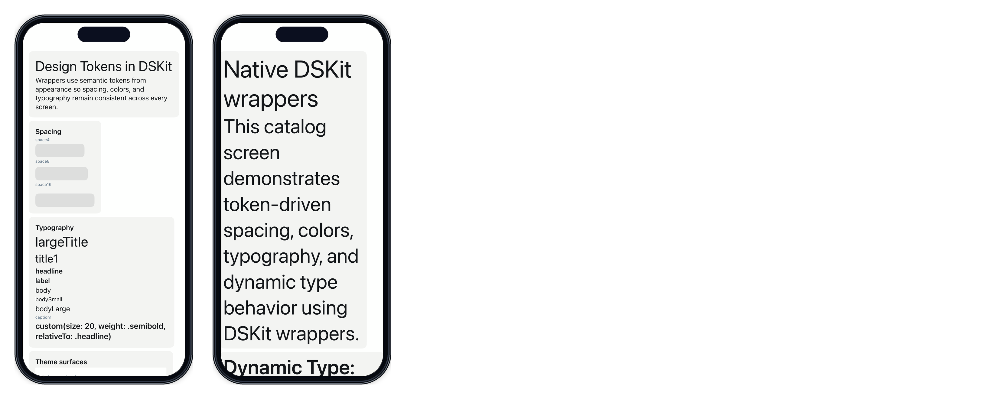

Related screen references: [DesignTokensPlaygroundScreen](Screens/DesignTokensPlaygroundScreen.md), [DynamicTypePlaygroundScreen](Screens/DynamicTypePlaygroundScreen.md).

## Maintenance

- Refresh these docs with `cd Scripts && ./documentation_generator.sh`.
- Every screen page must have at least one matching snapshot image in `DSKitExplorerTests/__Snapshots__/DSKitExplorerTests`.
- A screen named `ExampleScreen` uses `ExampleScreen.snapshot.png` and may also include variants such as `ExampleScreen_0.snapshot.png`.
- Framed screen previews are generated PNG files under `Content/Screens/Frames` from the source snapshot PNGs.
- Screen catalog strip previews are generated PNG files under `Content/Screens/Groups` from the framed screen previews.

> Generated by `Scripts/documentation_generator.sh`. Use this page as the table of contents for snapshot-backed DSKitExplorer screens.
