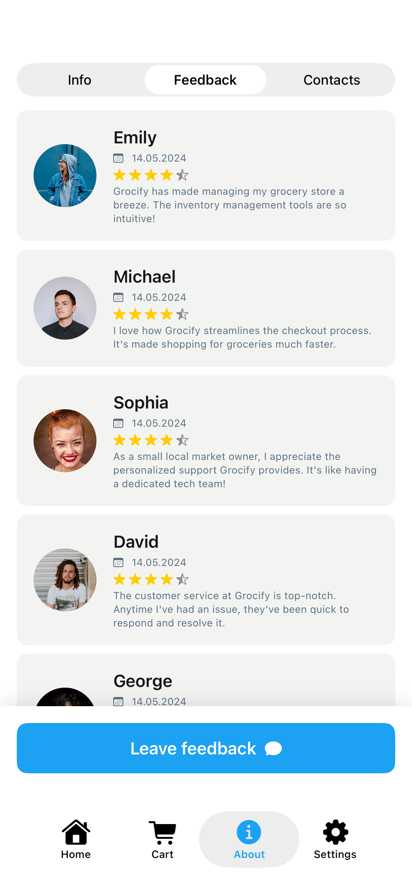

# AboutUsScreen2

## Preview

### AboutUsScreen2_0


### AboutUsScreen2_1



## DSKit Views Used

- [DSBottomContainer](../Views/DSBottomContainer.md)
- [DSButton](../Views/DSButton.md)
- [DSCoverFlow](../Views/DSCoverFlow.md)
- [DSHStack](../Views/DSHStack.md)
- [DSImageView](../Views/DSImageView.md)
- [DSList](../Views/DSList.md)
- [DSRatingView](../Views/DSRatingView.md)
- [DSSection](../Views/DSSection.md)
- [DSText](../Views/DSText.md)
- [DSVStack](../Views/DSVStack.md)

## Testable Example

```swift
struct Testable_AboutUsScreen2: View {
    var selectedTab: Int = 0
    @Environment(\.dismiss) var dismiss
    @State var tab: Int = 2
    var body: some View {
        TabView(selection: $tab) {
            Text("Shop")
                .tabItem {
                    Image(systemName: "house.fill")
                    Text("Home")
                }.tag(0)
            Text("Cart")
                .tabItem {
                    Image(systemName: "cart.fill")
                    Text("Cart")
                }.tag(1)
            AboutUsScreen2(selectedTab: selectedTab)
                .tabItem {
                    Image(systemName: "info.circle.fill")
                    Text("About")
                }.tag(2)

            DSVStack {
                DSButton(title: "Dismiss", style: .clear) {
                    dismiss()
                }
            }.tabItem {
                Image(systemName: "gearshape")
                Text("Settings")
            }.tag(3)
        }
    }
}
```

## Reference

> Generated by `Scripts/documentation_generator.sh`. Edit the screen source, snapshots, or generator instead of this file.

- Source: [DSKitExplorer/Screens/AboutUsScreen2.swift](../../DSKitExplorer/Screens/AboutUsScreen2.swift)
- Family: About
- Snapshot previews: 2
- DSKit views used: 10
