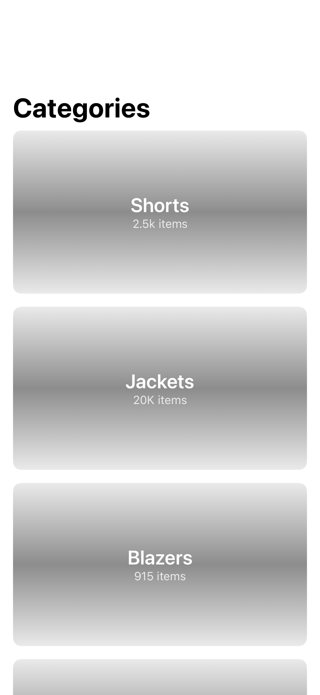

# Categories3

## Preview

### Categories3

## DSKit Views Used

- [DSImageView](../Views/DSImageView.md)
- [DSList](../Views/DSList.md)
- [DSSection](../Views/DSSection.md)
- [DSText](../Views/DSText.md)
- [DSVStack](../Views/DSVStack.md)

## Reference

> Generated by `Scripts/documentation_generator.sh`. Edit the screen source, snapshots, or generator instead of this file.

- Source: [DSKitExplorer/Screens/Categories3.swift](../../DSKitExplorer/Screens/Categories3.swift)
- Family: Commerce
- Snapshot preview: 1
- DSKit views used: 5
