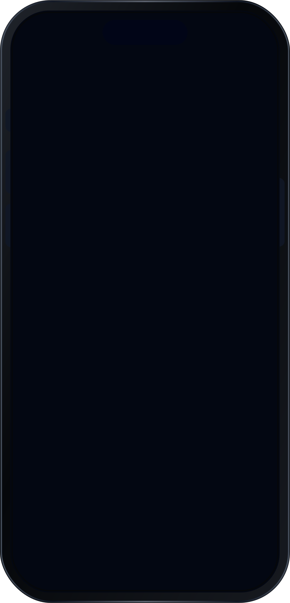

# DesignTokensPlaygroundScreen

## Preview

### DesignTokensPlaygroundScreen

## DSKit Views Used

- [DSButton](../Views/DSButton.md)
- [DSHStack](../Views/DSHStack.md)
- [DSText](../Views/DSText.md)
- [DSVStack](../Views/DSVStack.md)

## Reference

> Generated by `Scripts/documentation_generator.sh`. Edit the screen source, snapshots, or generator instead of this file.

- Source: [DSKitExplorer/ScreenView.swift](../../DSKitExplorer/ScreenView.swift)
- Family: Playgrounds
- Snapshot preview: 1
- DSKit views used: 4
