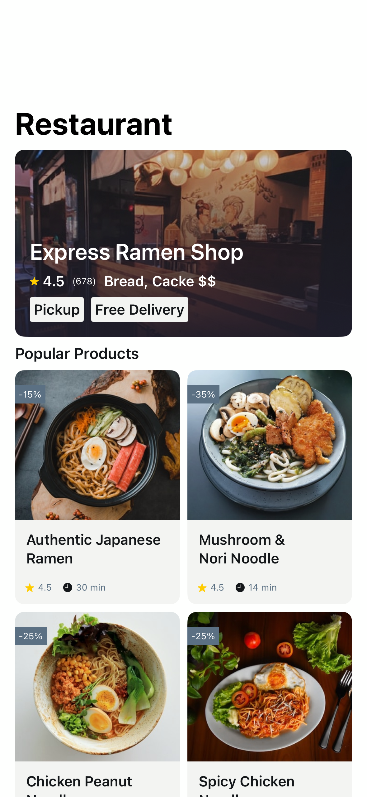

# FoodRestaurantScreen1

## Preview

### FoodRestaurantScreen1



## DSKit Views Used

- [DSGrid](../Views/DSGrid.md)
- [DSHStack](../Views/DSHStack.md)
- [DSImageView](../Views/DSImageView.md)
- [DSList](../Views/DSList.md)
- [DSSection](../Views/DSSection.md)
- [DSText](../Views/DSText.md)
- [DSVStack](../Views/DSVStack.md)

## Testable Example

```swift
struct Testable_FoodRestaurantScreen1: View {
    @Environment(\.dismiss) var dismiss
    var body: some View {
        NavigationView {
            FoodRestaurantScreen1()
                .navigationTitle("Restaurant")
        }
    }
}
```

## Reference

> Generated by `Scripts/documentation_generator.sh`. Edit the screen source, snapshots, or generator instead of this file.

- Source: [DSKitExplorer/Screens/FoodRestaurantScreen1.swift](../../DSKitExplorer/Screens/FoodRestaurantScreen1.swift)
- Family: Food
- Snapshot preview: 1
- DSKit views used: 7
