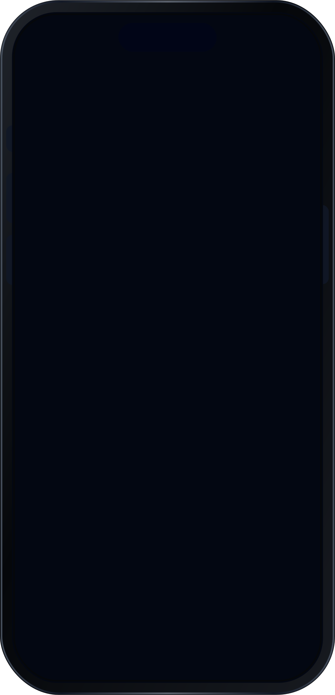

# HomeScreen2

## Preview

### HomeScreen2

## DSKit Views Used

- [DSButton](../Views/DSButton.md)
- [DSCoverFlow](../Views/DSCoverFlow.md)
- [DSGrid](../Views/DSGrid.md)
- [DSHStack](../Views/DSHStack.md)
- [DSImageView](../Views/DSImageView.md)
- [DSList](../Views/DSList.md)
- [DSPriceView](../Views/DSPriceView.md)
- [DSSection](../Views/DSSection.md)
- [DSSectionHeaderView](../Views/DSSectionHeaderView.md)
- [DSText](../Views/DSText.md)
- [DSVStack](../Views/DSVStack.md)

## Reference

> Generated by `Scripts/documentation_generator.sh`. Edit the screen source, snapshots, or generator instead of this file.

- Source: [DSKitExplorer/Screens/HomeScreen2.swift](../../DSKitExplorer/Screens/HomeScreen2.swift)
- Family: Home
- Snapshot preview: 1
- DSKit views used: 11
