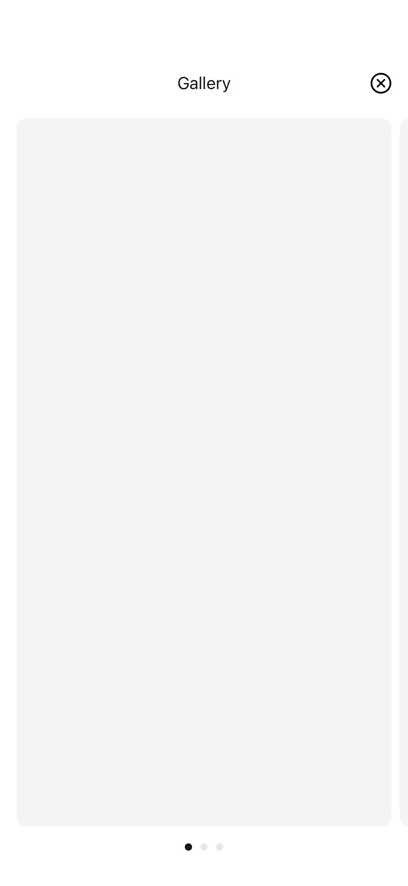

# ImageGalleryScreen2

## Preview

### ImageGalleryScreen2

## DSKit Views Used

- [DSCoverFlow](../Views/DSCoverFlow.md)
- [DSImageView](../Views/DSImageView.md)
- [DSText](../Views/DSText.md)
- [DSVStack](../Views/DSVStack.md)

## Reference

> Generated by `Scripts/documentation_generator.sh`. Edit the screen source, snapshots, or generator instead of this file.

- Source: [DSKitExplorer/Screens/ImageGalleryScreen2.swift](../../DSKitExplorer/Screens/ImageGalleryScreen2.swift)
- Family: Gallery
- Snapshot preview: 1
- DSKit views used: 4
