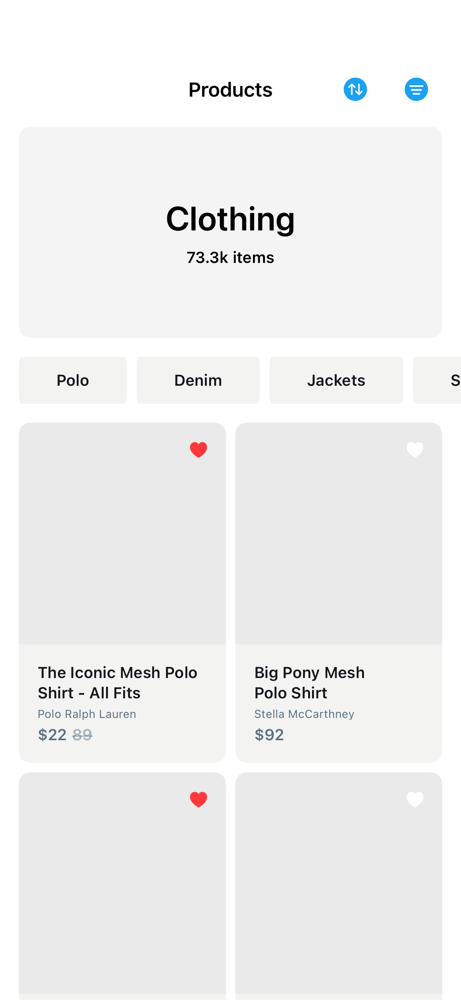

# Items5

## Preview

### Items5



## DSKit Views Used

- [DSGrid](../Views/DSGrid.md)
- [DSHScroll](../Views/DSHScroll.md)
- [DSImageView](../Views/DSImageView.md)
- [DSList](../Views/DSList.md)
- [DSPriceView](../Views/DSPriceView.md)
- [DSSection](../Views/DSSection.md)
- [DSText](../Views/DSText.md)
- [DSToolbarSFSymbolButton](../Views/DSToolbarSFSymbolButton.md)
- [DSVStack](../Views/DSVStack.md)

## Testable Example

```swift
struct Testable_Items5: View {
    var body: some View {
        NavigationView {
            Items5()
                .navigationTitle("Products")
                .platformBasedNavigationBarTitleDisplayModeInline()
        }
    }
}
```

## Reference

> Generated by `Scripts/documentation_generator.sh`. Edit the screen source, snapshots, or generator instead of this file.

- Source: [DSKitExplorer/Screens/Items5.swift](../../DSKitExplorer/Screens/Items5.swift)
- Family: Commerce
- Snapshot preview: 1
- DSKit views used: 9
