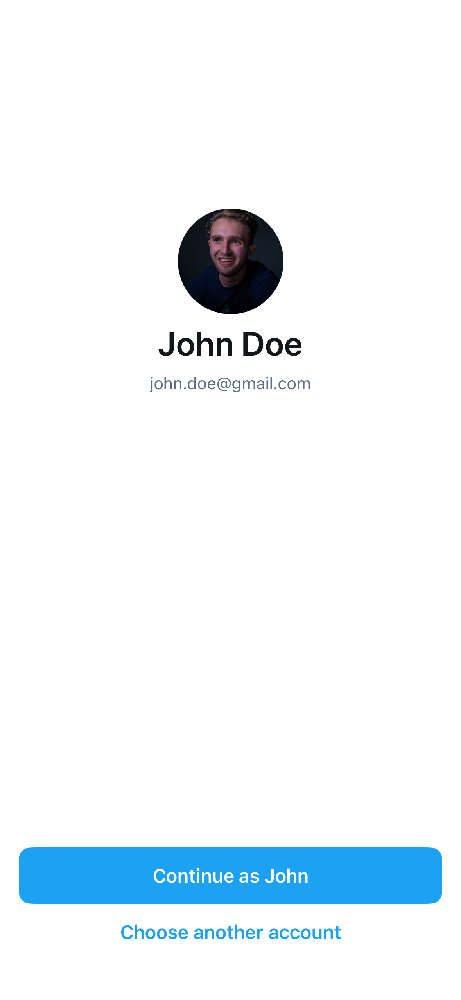

# LogInScreen4

## Preview

### LogInScreen4



## DSKit Views Used

- [DSButton](../Views/DSButton.md)
- [DSImageView](../Views/DSImageView.md)
- [DSText](../Views/DSText.md)
- [DSVStack](../Views/DSVStack.md)

## Testable Example

```swift
struct Testable_LogInScreen4: View {
    var body: some View {
        LogInScreen4()
    }
}
```

## Reference

> Generated by `Scripts/documentation_generator.sh`. Edit the screen source, snapshots, or generator instead of this file.

- Source: [DSKitExplorer/Screens/LogInScreen4.swift](../../DSKitExplorer/Screens/LogInScreen4.swift)
- Family: Authentication
- Snapshot preview: 1
- DSKit views used: 4
