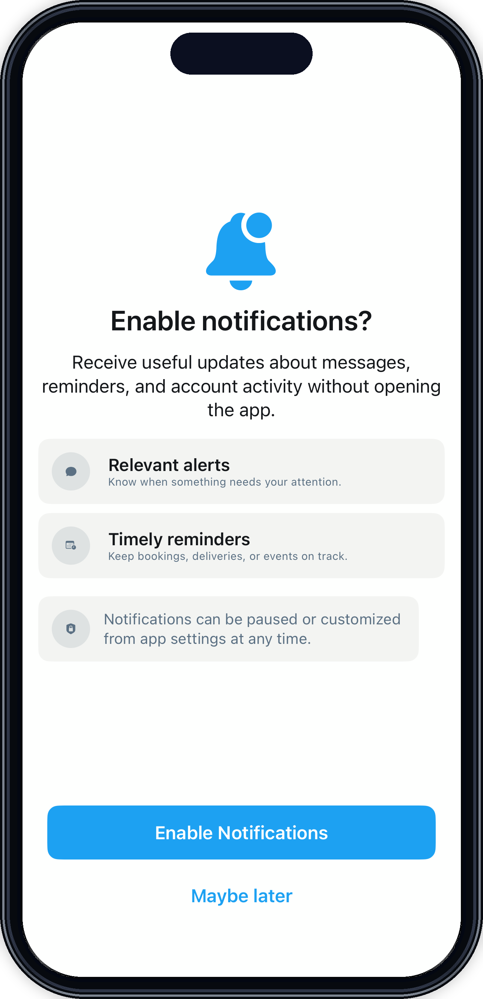

# NotificationsPermissionScreen

## Preview

### NotificationsPermissionScreen

## DSKit Views Used

- [DSPermissionPromptView](../Views/DSPermissionPromptView.md)

## Reference

> Generated by `Scripts/documentation_generator.sh`. Edit the screen source, snapshots, or generator instead of this file.

- Source: [DSKitExplorer/Screens/NotificationsPermissionScreen.swift](../../DSKitExplorer/Screens/NotificationsPermissionScreen.swift)
- Family: News
- Snapshot preview: 1
- DSKit views used: 1
