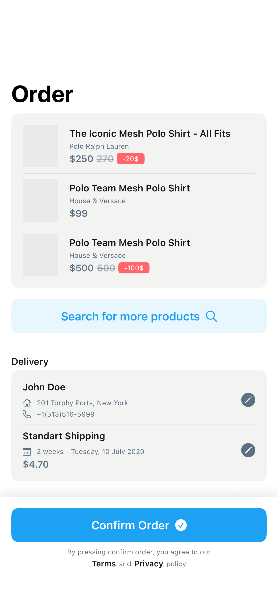

# Order1

## Preview

### Order1



## DSKit Views Used

- [DSBottomContainer](../Views/DSBottomContainer.md)
- [DSButton](../Views/DSButton.md)
- [DSDivider](../Views/DSDivider.md)
- [DSGroupedList](../Views/DSGroupedList.md)
- [DSHStack](../Views/DSHStack.md)
- [DSImageView](../Views/DSImageView.md)
- [DSList](../Views/DSList.md)
- [DSPriceView](../Views/DSPriceView.md)
- [DSSection](../Views/DSSection.md)
- [DSTermsAndConditions](../Views/DSTermsAndConditions.md)
- [DSText](../Views/DSText.md)
- [DSVStack](../Views/DSVStack.md)

## Testable Example

```swift
struct Testable_Order1: View {
    var body: some View {
        NavigationView {
            Order1()
                .navigationTitle("Order")
        }
    }
}
```

## Reference

> Generated by `Scripts/documentation_generator.sh`. Edit the screen source, snapshots, or generator instead of this file.

- Source: [DSKitExplorer/Screens/Order1.swift](../../DSKitExplorer/Screens/Order1.swift)
- Family: Commerce
- Snapshot preview: 1
- DSKit views used: 12
