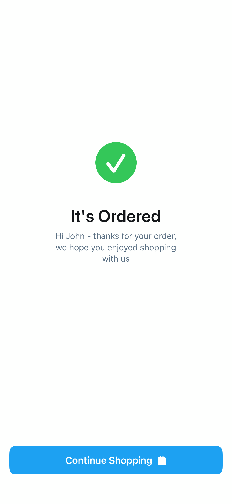

# Order3

## Preview

### Order3



## DSKit Views Used

- [DSButton](../Views/DSButton.md)
- [DSImageView](../Views/DSImageView.md)
- [DSText](../Views/DSText.md)
- [DSVStack](../Views/DSVStack.md)

## Testable Example

```swift
struct Testable_Order3: View {
    var body: some View {
        Order3()
    }
}
```

## Reference

> Generated by `Scripts/documentation_generator.sh`. Edit the screen source, snapshots, or generator instead of this file.

- Source: [DSKitExplorer/Screens/Order3.swift](../../DSKitExplorer/Screens/Order3.swift)
- Family: Commerce
- Snapshot preview: 1
- DSKit views used: 4
