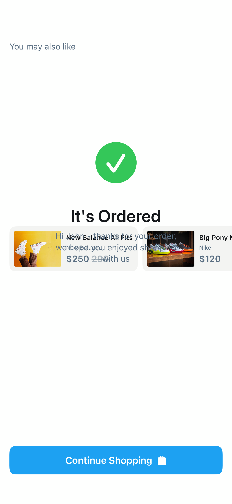

# Order4

## Preview

### Order4



## DSKit Views Used

- [DSButton](../Views/DSButton.md)
- [DSHScroll](../Views/DSHScroll.md)
- [DSHStack](../Views/DSHStack.md)
- [DSImageView](../Views/DSImageView.md)
- [DSPriceView](../Views/DSPriceView.md)
- [DSText](../Views/DSText.md)
- [DSVStack](../Views/DSVStack.md)

## Testable Example

```swift
struct Testable_Order4: View {
    var body: some View {
        Order4()
    }
}
```

## Reference

> Generated by `Scripts/documentation_generator.sh`. Edit the screen source, snapshots, or generator instead of this file.

- Source: [DSKitExplorer/Screens/Order4.swift](../../DSKitExplorer/Screens/Order4.swift)
- Family: Commerce
- Snapshot preview: 1
- DSKit views used: 7
