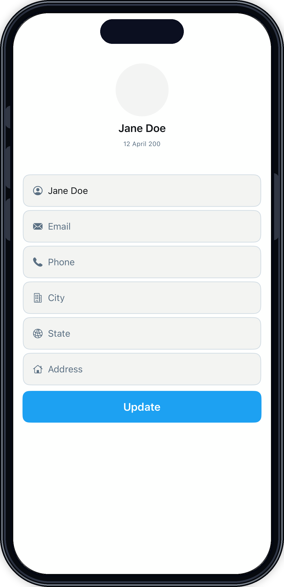

# ProfileScreen2

## Preview

### ProfileScreen2

## DSKit Views Used

- [DSButton](../Views/DSButton.md)
- [DSImageView](../Views/DSImageView.md)
- [DSList](../Views/DSList.md)
- [DSSection](../Views/DSSection.md)
- [DSText](../Views/DSText.md)
- [DSTextField](../Views/DSTextField.md)
- [DSVStack](../Views/DSVStack.md)

## Reference

> Generated by `Scripts/documentation_generator.sh`. Edit the screen source, snapshots, or generator instead of this file.

- Source: [DSKitExplorer/Screens/ProfileScreen2.swift](../../DSKitExplorer/Screens/ProfileScreen2.swift)
- Family: Profile
- Snapshot preview: 1
- DSKit views used: 7
