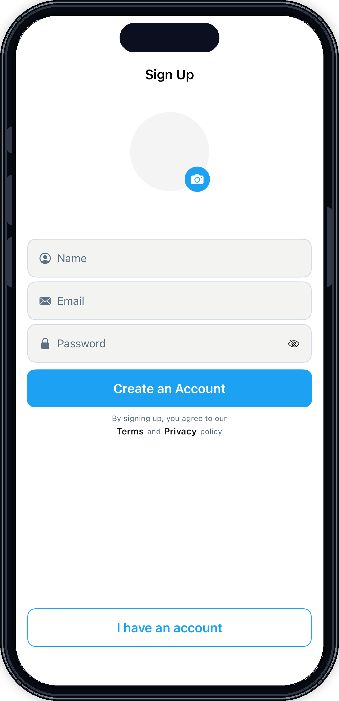

# SignUpScreen2

## Preview

### SignUpScreen2

## DSKit Views Used

- [DSButton](../Views/DSButton.md)
- [DSImageView](../Views/DSImageView.md)
- [DSTermsAndConditions](../Views/DSTermsAndConditions.md)
- [DSTextField](../Views/DSTextField.md)
- [DSVStack](../Views/DSVStack.md)

## Reference

> Generated by `Scripts/documentation_generator.sh`. Edit the screen source, snapshots, or generator instead of this file.

- Source: [DSKitExplorer/Screens/SignUpScreen2.swift](../../DSKitExplorer/Screens/SignUpScreen2.swift)
- Family: Authentication
- Snapshot preview: 1
- DSKit views used: 5
