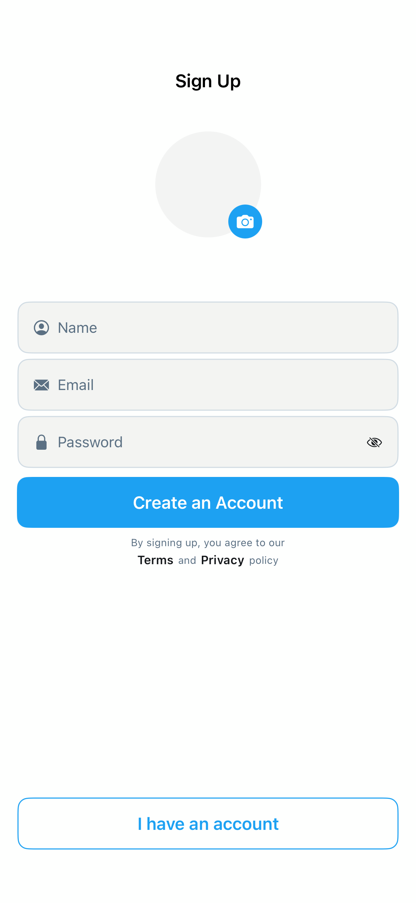

# SignUpScreen2

## Preview

### SignUpScreen2



## DSKit Views Used

- [DSButton](../Views/DSButton.md)
- [DSImageView](../Views/DSImageView.md)
- [DSTermsAndConditions](../Views/DSTermsAndConditions.md)
- [DSTextField](../Views/DSTextField.md)
- [DSVStack](../Views/DSVStack.md)

## Testable Example

```swift
struct Testable_SignUpScreen2: View {
    var body: some View {
        Group {
            if #available(iOS 16.0, *) {
                NavigationStack {
                    SignUpScreen2()
                        .platformBasedNavigationBarTitleDisplayModeInline()
                }
            } else {
                NavigationView {
                    SignUpScreen2()
                        .platformBasedNavigationBarTitleDisplayModeInline()
                }
            }
        }
    }
}
```

## Reference

> Generated by `Scripts/documentation_generator.sh`. Edit the screen source, snapshots, or generator instead of this file.

- Source: [DSKitExplorer/Screens/SignUpScreen2.swift](../../DSKitExplorer/Screens/SignUpScreen2.swift)
- Family: Authentication
- Snapshot preview: 1
- DSKit views used: 5
