# DSKit Views and Components

## Component Catalog

| Preview | Component |
| --- | --- |
| 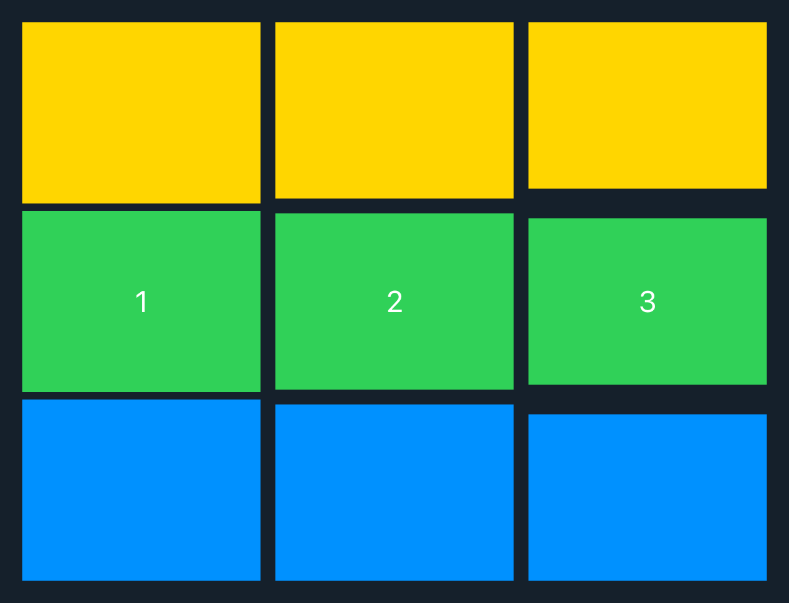 | [DSVStack](Views/DSVStack.md) |
| 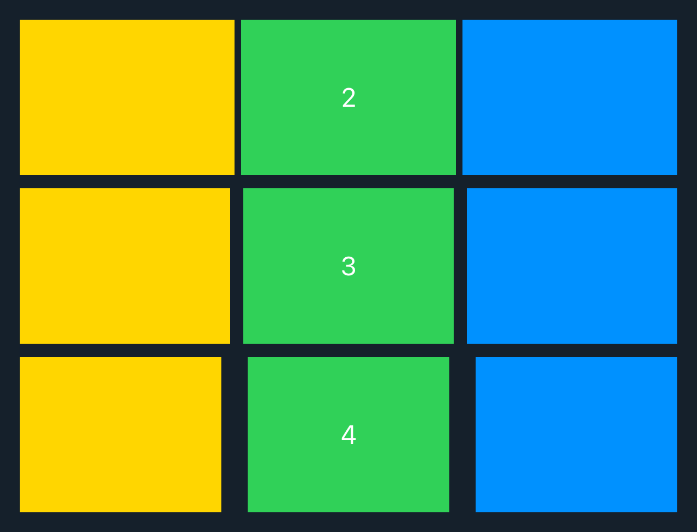 | [DSHStack](Views/DSHStack.md) |
|  | [DSGrid](Views/DSGrid.md) |
| 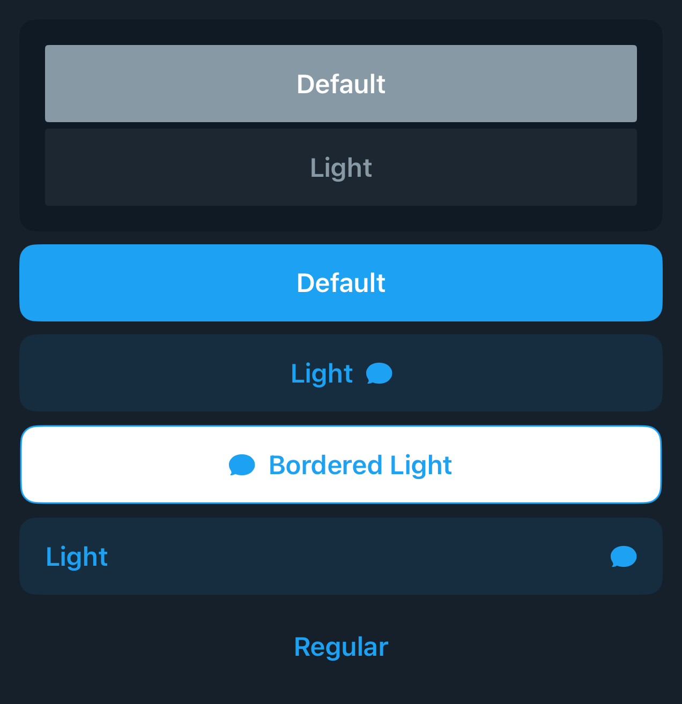 | [DSButton](Views/DSButton.md) |
| 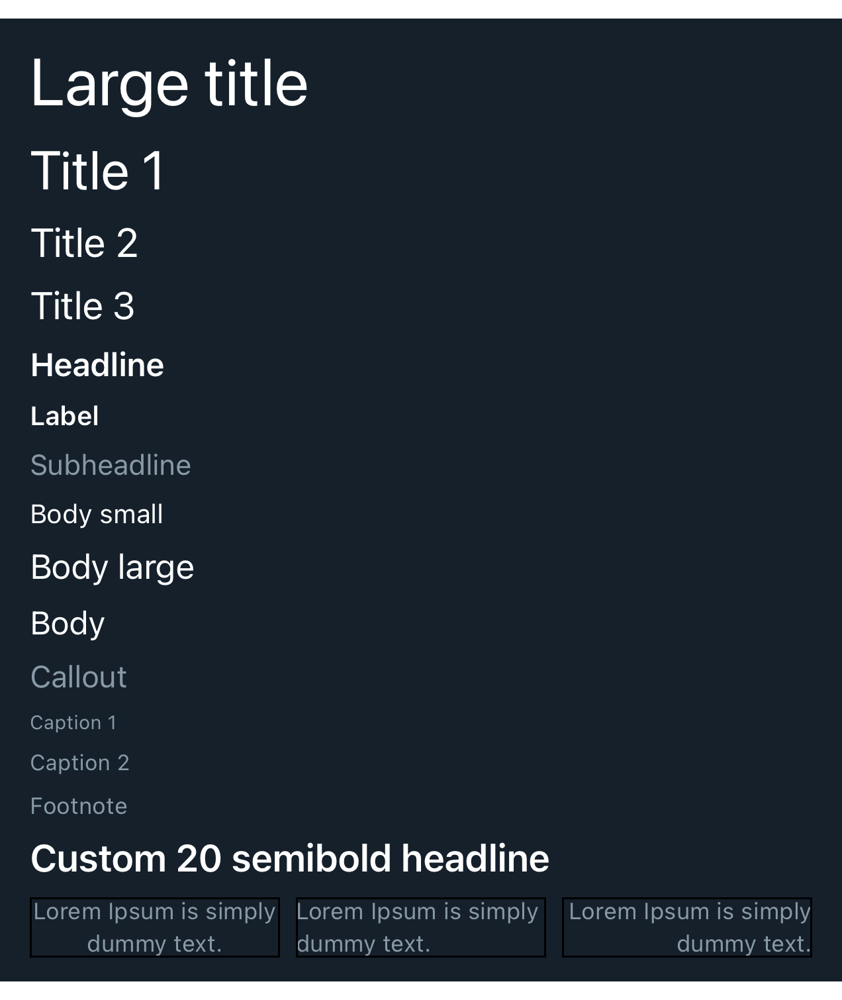 | [DSText](Views/DSText.md) |
|  | [DSHScroll](Views/DSHScroll.md) |
|  | [DSCoverFlow](Views/DSCoverFlow.md) |
| 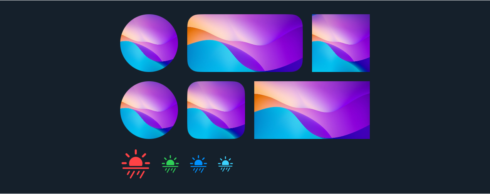 | [DSImageView](Views/DSImageView.md) |
|  | [DSArticleRows](Views/DSArticleRows.md) |
|  | [DSAuthorView](Views/DSAuthorView.md) |
|  | [DSBottomContainer](Views/DSBottomContainer.md) |
|  | [DSCardAccessory](Views/DSCardAccessory.md) |
|  | [DSCardSurface](Views/DSCardSurface.md) |
|  | [DSChevronView](Views/DSChevronView.md) |
|  | [DSChipsView](Views/DSChipsView.md) |
| 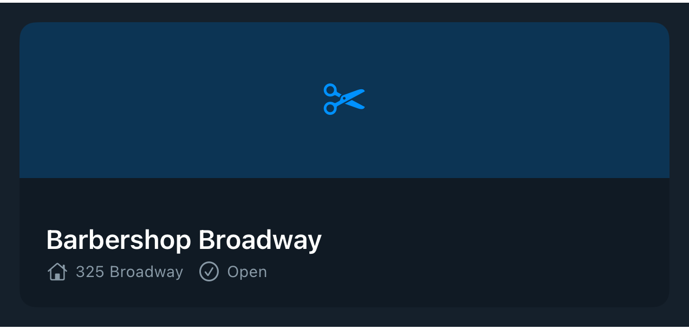 | [DSContentCard](Views/DSContentCard.md) |
|  | [DSDivider](Views/DSDivider.md) |
|  | [DSEntityCardRow](Views/DSEntityCardRow.md) |
| 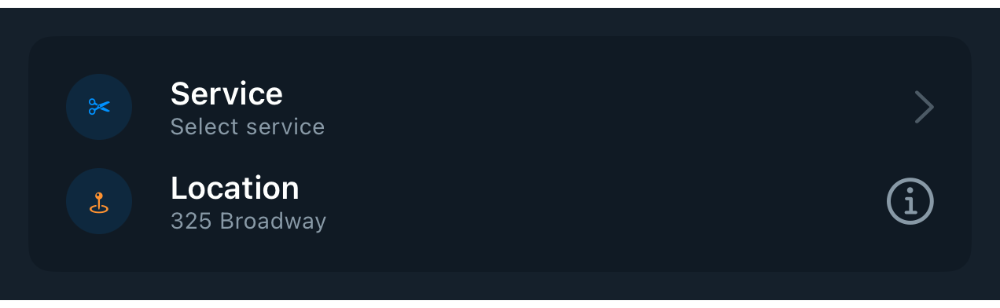 | [DSEntityRow](Views/DSEntityRow.md) |
| 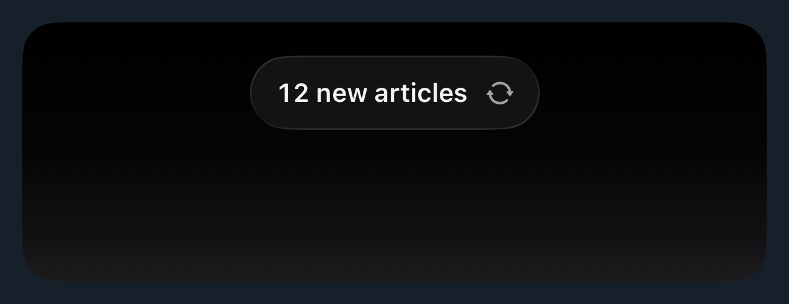 | [DSFloatingBannerView](Views/DSFloatingBannerView.md) |
| 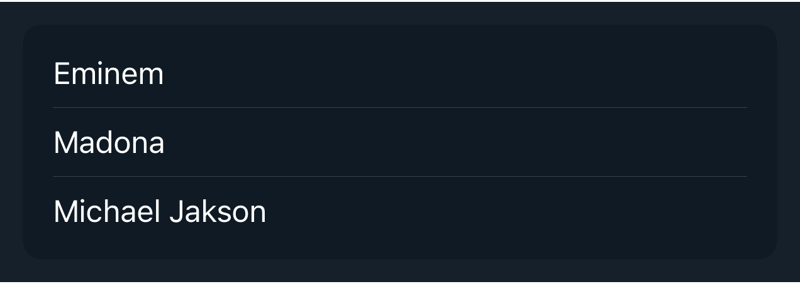 | [DSGroupedList](Views/DSGroupedList.md) |
|  | [DSIconBadgeView](Views/DSIconBadgeView.md) |
| 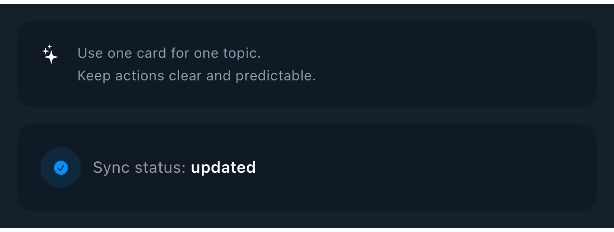 | [DSInfoCallout](Views/DSInfoCallout.md) |
|  | [DSInlineTagView](Views/DSInlineTagView.md) |
| 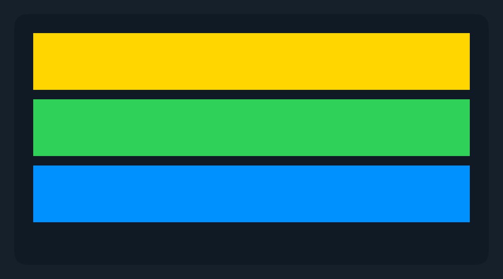 | [DSLazyVStack](Views/DSLazyVStack.md) |
|  | [DSLetterBadgeView](Views/DSLetterBadgeView.md) |
| 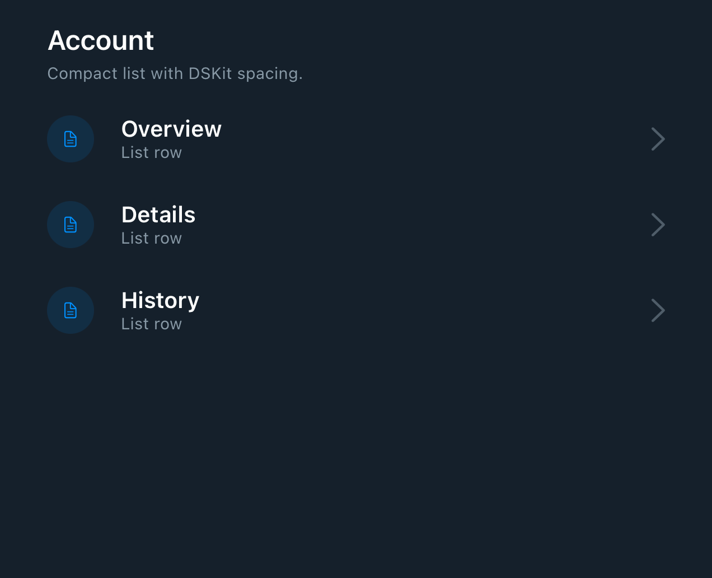 | [DSList](Views/DSList.md) |
| 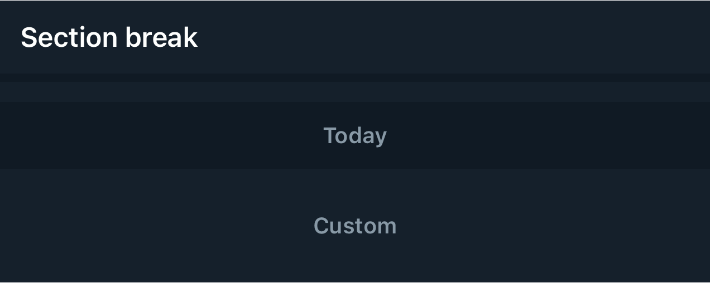 | [DSListSeparatorView](Views/DSListSeparatorView.md) |
|  | [DSMetadataRow](Views/DSMetadataRow.md) |
| 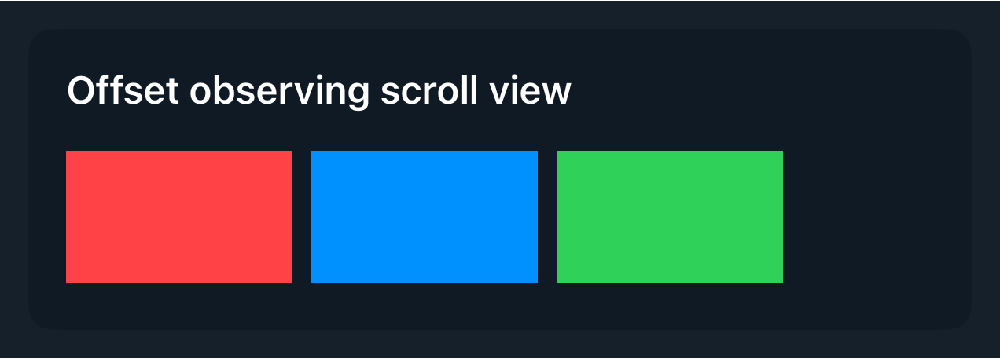 | [DSOffsetObservingScrollView](Views/DSOffsetObservingScrollView.md) |
|  | [DSPickerView](Views/DSPickerView.md) |
| 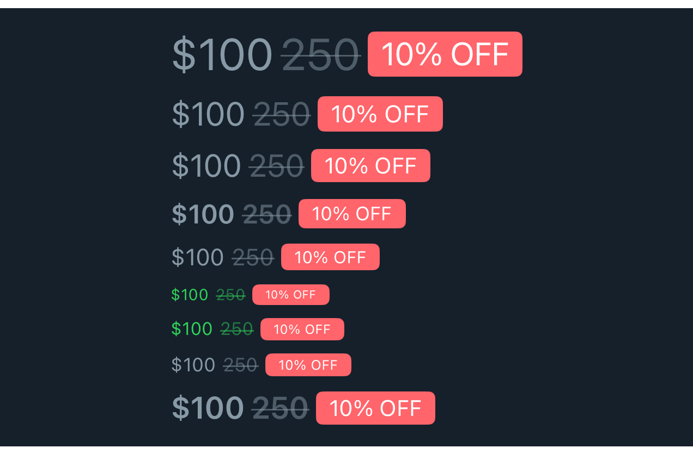 | [DSPriceView](Views/DSPriceView.md) |
|  | [DSQuantityPicker](Views/DSQuantityPicker.md) |
|  | [DSRadioPickerView](Views/DSRadioPickerView.md) |
|  | [DSRatingView](Views/DSRatingView.md) |
|  | [DSRelativeTimeTag](Views/DSRelativeTimeTag.md) |
|  | [DSSFSymbolButton](Views/DSSFSymbolButton.md) |
|  | [DSScrollAnchorAffordance](Views/DSScrollAnchorAffordance.md) |
|  | [DSSection](Views/DSSection.md) |
|  | [DSSectionHeaderView](Views/DSSectionHeaderView.md) |
|  | [DSTabPagingView](Views/DSTabPagingView.md) |
|  | [DSTermsAndConditions](Views/DSTermsAndConditions.md) |
| 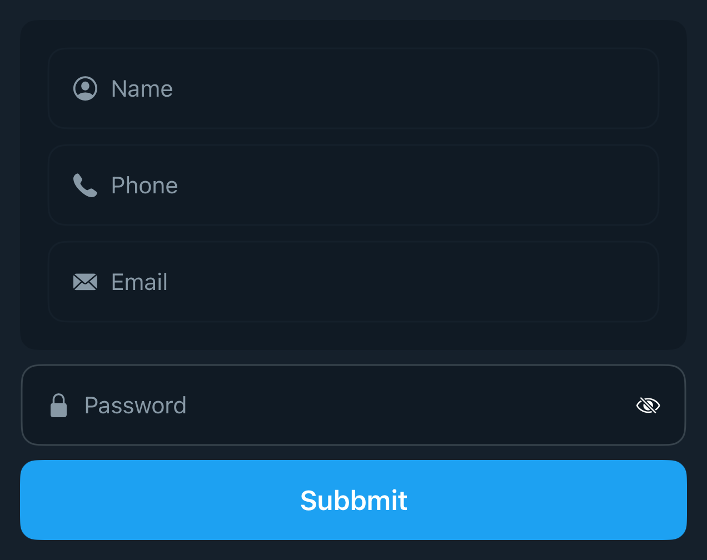 | [DSTextField](Views/DSTextField.md) |
| 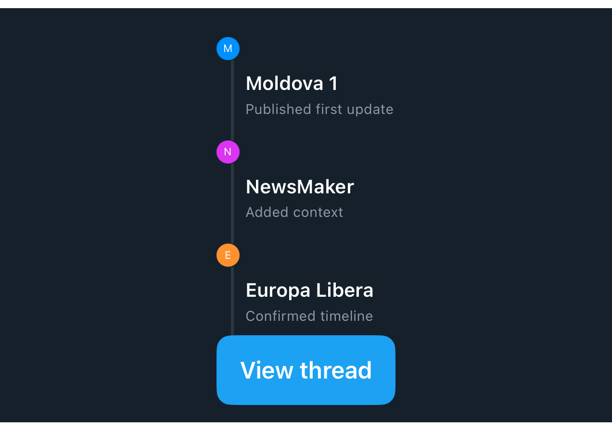 | [DSThread](Views/DSThread.md) |
|  | [DSToolbarSFSymbolButton](Views/DSToolbarSFSymbolButton.md) |

## Maintenance

- Refresh these docs with `cd Scripts && ./documentation_generator.sh`.
- Update source comments and `Testable_*` examples in `DSKit/Sources/DSKit/Views` to improve generated pages.
- Every `DSKit/Sources/DSKit/Views/*.swift` file must have a matching preview image at `DSKitTests/__Snapshots__/DSKitTests/<Component>.snapshot.png`.

> Generated by `Scripts/documentation_generator.sh`. Use this page as the table of contents for DSKit view docs.

## Agent Quick Start

- Scan the preview column to find the DSKit view you need, then open its dedicated page.
- Each preview comes from the required snapshot image in `DSKitTests/__Snapshots__/DSKitTests`.
- Generated files should be refreshed from source comments and snapshots, not edited by hand.
