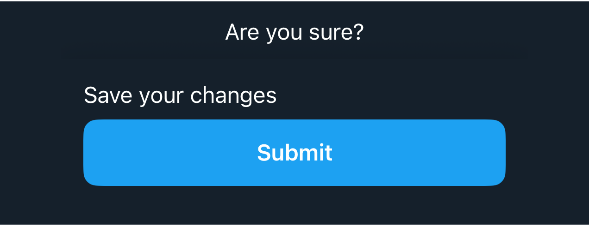

# DSBottomContainer

## Overview

`DSBottomContainer` is component designed to display content at the bottom of the screen, commonly used for adding buttons or contextual information to forms and dialogs. It enhances the display by adding a top shadow and managing spacing, ensuring that the content is both visually appealing and functionally positioned.

#### Initializer:
Initializes a `DSBottomContainer` with a view builder closure that defines its content.
- Parameters:
- `content`: A closure returning the content of the container. This closure is marked with `@ViewBuilder` to allow for multiple views to be composed together.

#### Usage:
`DSBottomContainer` is typically used to anchor controls or information at the bottom of the interface, adding visual structure and focus to bottom-placed elements.

## Example

```swift
struct Testable_DSBottomContainer: View {
    var body: some View {
        DSVStack {
            DSText("Are you sure?")
        }
        .safeAreaInset(edge: .bottom) {
            DSBottomContainer {
                DSText("Save your changes")
                DSButton(title: "Submit", action: {})
            }.dsScreen()
        }
        .dsScreen()
    }
}
```

## Preview



## DSKitExplorer Usage

- [AboutUsScreen2](../Screens/AboutUsScreen2.md) ([source](../../DSKitExplorer/Screens/AboutUsScreen2.swift))
- [BookingScreen2](../Screens/BookingScreen2.md) ([source](../../DSKitExplorer/Screens/BookingScreen2.swift))
- [BookingScreen3](../Screens/BookingScreen3.md) ([source](../../DSKitExplorer/Screens/BookingScreen3.swift))
- [BookingScreen5](../Screens/BookingScreen5.md) ([source](../../DSKitExplorer/Screens/BookingScreen5.swift))
- [CartScreen1](../Screens/CartScreen1.md) ([source](../../DSKitExplorer/Screens/CartScreen1.swift))
- [CartScreen2](../Screens/CartScreen2.md) ([source](../../DSKitExplorer/Screens/CartScreen2.swift))
- [CartScreen3](../Screens/CartScreen3.md) ([source](../../DSKitExplorer/Screens/CartScreen3.swift))
- [CartScreen4](../Screens/CartScreen4.md) ([source](../../DSKitExplorer/Screens/CartScreen4.swift))
- [CartScreen5](../Screens/CartScreen5.md) ([source](../../DSKitExplorer/Screens/CartScreen5.swift))
- [Filters1](../Screens/Filters1.md) ([source](../../DSKitExplorer/Screens/Filters1.swift))
- See [UsageIndex.md#dsbottomcontainer](UsageIndex.md#dsbottomcontainer) for 15 more references.

## Related Components

[DSButton](DSButton.md), [DSText](DSText.md), [DSVStack](DSVStack.md)

## Reference

> Generated by `Scripts/documentation_generator.sh`. Edit the Swift source comment or generator instead of this file.

- Source: [DSKit/Sources/DSKit/Views/DSBottomContainer.swift](../../DSKit/Sources/DSKit/Views/DSBottomContainer.swift)
- Full usage map: [UsageIndex.md#dsbottomcontainer](UsageIndex.md#dsbottomcontainer)
- Explorer usage: 25 screen files
- Type: Component
- Snapshot: [DSBottomContainer.snapshot.png](../../DSKitTests/__Snapshots__/DSKitTests/DSBottomContainer.snapshot.png)
