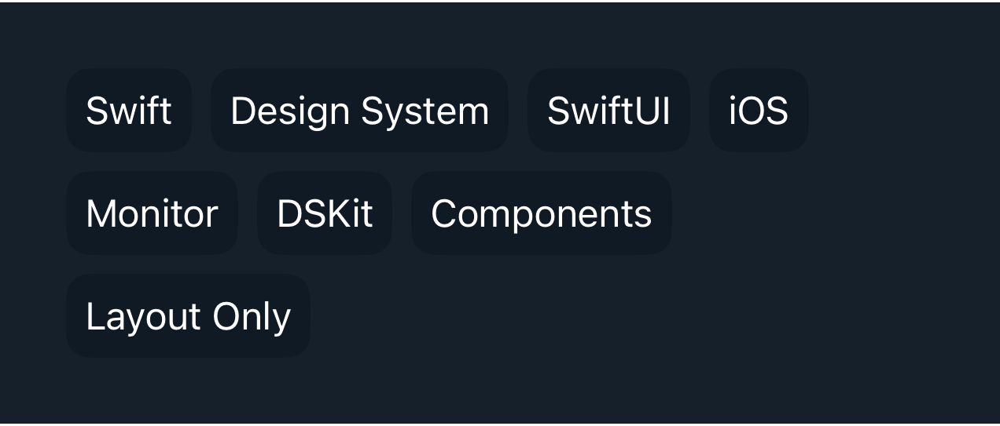

# DSChipsView

## Overview

`DSChipsView` is a reusable DSKit layout container for chip and tag collections. It lays out child views horizontally and wraps items onto the next line based on each item's intrinsic width.

#### Initialization:
Initializes `DSChipsView` with data, identity, spacing, and a content builder.
- Parameters:
- `data`: The collection of items to render.
- `id`: A key path to a stable identifier for each element.
- `horizontalSpacing`: Horizontal spacing between chips.
- `verticalSpacing`: Vertical spacing between wrapped rows.
- `content`: A closure that returns the chip content for each element.

#### Usage:
`DSChipsView` is intentionally layout-only. It does not impose visual styling, selection behavior, or tap handling, so callers can render chips, filters, or tags with the appearance they need while reusing a single wrapping layout.

## Example

```swift
struct Testable_DSChipsView: View {
    let values: [DSChipsPreviewChip] = [
        .init(id: "swift", title: "Swift", style: .secondary),
        .init(id: "design-system", title: "Design System", style: .primary),
        .init(id: "swiftui", title: "SwiftUI", style: .secondary),
        .init(id: "ios", title: "iOS", style: .secondary),
        .init(id: "monitor", title: "Monitor", style: .primary),
        .init(id: "dskit", title: "DSKit", style: .secondary),
        .init(id: "components", title: "Components", style: .primary),
        .init(id: "layout", title: "Layout Only", style: .secondary)
    ]

    var body: some View {
        DSVStack {
            DSChipsView(data: values, id: \.id) { item in
                DSChipsPreviewTag(title: item.title, style: item.style)
            }
            .frame(maxWidth: .infinity, alignment: .leading)
        }
        .dsPadding()
    }
}
```

## Preview



## DSKitExplorer Usage

No direct `DSKitExplorer/Screens` usage was found.

## Related Components

[DSText](DSText.md), [DSVStack](DSVStack.md)

## Reference

> Generated by `Scripts/documentation_generator.sh`. Edit the Swift source comment or generator instead of this file.

- Source: [DSKit/Sources/DSKit/Views/DSChipsView.swift](../../DSKit/Sources/DSKit/Views/DSChipsView.swift)
- Full usage map: [UsageIndex.md#dschipsview](UsageIndex.md#dschipsview)
- Explorer usage: 0 screen files
- Type: Primitive
- Snapshot: [DSChipsView.snapshot.png](../../DSKitTests/__Snapshots__/DSKitTests/DSChipsView.snapshot.png)
