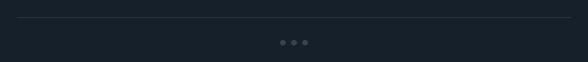

# DSDivider

## Overview

`DSDivider` is a simple, design-aware component within the DSKit framework that renders a visual separation line between UI elements. It conforms to the design system's aesthetics, adapting its appearance based on environmental settings.

#### Initialization:
The `DSDivider` is initialized without parameters, defaulting to predefined styling that respects the current theme and spacing conventions.

#### Usage:
`DSDivider` is used to visually separate content within a view, often between list items, sections in a form, or alongside layout changes.

## Example

```swift
struct Testable_DSDivider: View {
    var body: some View {
        DSVStack(spacing: .space16) {
            DSDivider()
            DSDivider(style: .dots())
        }
    }
}
```

## Preview



## DSKitExplorer Usage

- [AboutUsScreen1](../Screens/AboutUsScreen1.md) ([source](../../DSKitExplorer/Screens/AboutUsScreen1.swift))
- [Order1](../Screens/Order1.md) ([source](../../DSKitExplorer/Screens/Order1.swift))

## Related Components

[DSVStack](DSVStack.md)

## Reference

> Generated by `Scripts/documentation_generator.sh`. Edit the Swift source comment or generator instead of this file.

- Source: [DSKit/Sources/DSKit/Views/DSDivider.swift](../../DSKit/Sources/DSKit/Views/DSDivider.swift)
- Full usage map: [UsageIndex.md#dsdivider](UsageIndex.md#dsdivider)
- Explorer usage: 2 screen files
- Type: Primitive
- Snapshot: [DSDivider.snapshot.png](../../DSKitTests/__Snapshots__/DSKitTests/DSDivider.snapshot.png)
