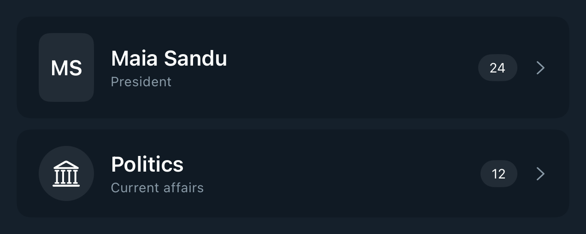

# DSEntityListRow

## Overview

`DSEntityListRow` renders a compact tappable entity row with custom leading content, optional subtitle, count pill, and optional accessory symbol. It is intended for people, source, category, search-result, and settings-style lists where the app already has display-ready values.

#### Initialization:
Initializes a list row with title, optional subtitle, count text, accessibility count label, leading content, optional accessory, and tap action.
- Parameters:
- `title`: Main row title.
- `subtitle`: Optional secondary text.
- `countText`: Optional compact count pill text.
- `countAccessibilityLabel`: Optional accessibility label for the count pill.
- `leadingSize`: Fixed DSKit size applied to the leading view.
- `height`: Fixed DSKit height applied to the row.
- `accessorySystemName`: Optional trailing SF Symbol.
- `reservedSubtitleLineCount`: Optional reserved subtitle height for async metadata updates.
- `leading`: Leading icon, avatar, or badge content.
- `onTap`: Optional tap action.

#### Usage:
Use `DSEntityListRow` to standardize entity rows across search, focus, directory, and picker screens. Pair it with `DSEntityAvatarView`, `DSEntityCategoryIconView`, or custom leading content.

## Example

```swift
struct Testable_DSEntityListRow: View {
    var body: some View {
        DSVStack(spacing: .space8) {
            DSEntityListRow(
                title: "Maia Sandu",
                subtitle: "President",
                countText: "24",
                countAccessibilityLabel: "24 mentions",
                leadingSize: DSEntityListRowLayout.peopleAvatarSize,
                accessorySystemName: "chevron.right"
            ) {
                DSEntityAvatarView(
                    imageURL: nil,
                    title: "Maia Sandu",
                    colorSeed: "Maia Sandu",
                    initialsMode: .forceTwo,
                    size: DSEntityListRowLayout.peopleAvatarSize,
                    shape: .roundedRectangle(cornerRadius: 8)
                )
            }

            DSEntityListRow(
                title: "Politics",
                subtitle: "Current affairs",
                countText: "12",
                accessorySystemName: "chevron.right"
            ) {
                DSEntityCategoryIconView(systemName: "building.columns")
            }
        }
    }
}
```

## Preview



## DSKitExplorer Usage

No direct `DSKitExplorer/Screens` usage was found.

## Related Components

[DSHStack](DSHStack.md), [DSImageView](DSImageView.md), [DSLetterBadgeView](DSLetterBadgeView.md), [DSSection](DSSection.md), [DSText](DSText.md), [DSVStack](DSVStack.md)

## Reference

> Generated by `Scripts/documentation_generator.sh`. Edit the Swift source comment or generator instead of this file.

- Source: [DSKit/Sources/DSKit/Views/DSEntityListRow.swift](../../DSKit/Sources/DSKit/Views/DSEntityListRow.swift)
- Full usage map: [UsageIndex.md#dsentitylistrow](UsageIndex.md#dsentitylistrow)
- Explorer usage: 0 screen files
- Type: Component
- Snapshot: [DSEntityListRow.snapshot.png](../../DSKitTests/__Snapshots__/DSKitTests/DSEntityListRow.snapshot.png)
