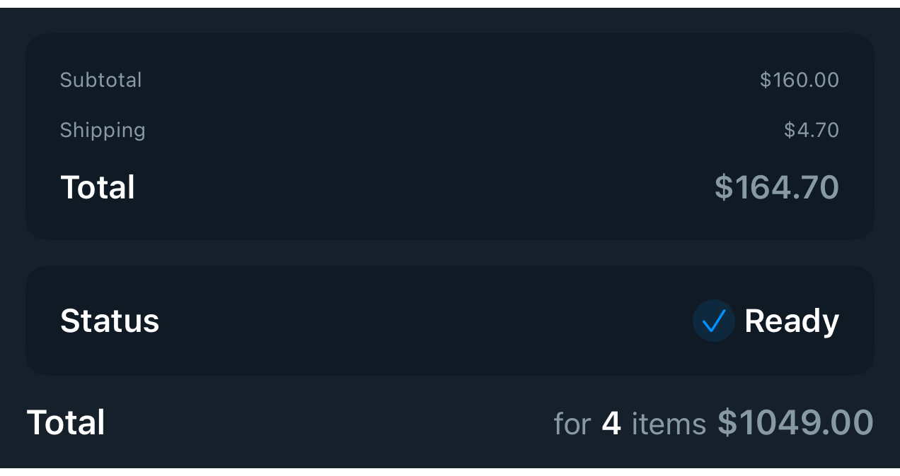

# DSKeyValueRow

## Overview

`DSKeyValueRow` is a compact row for displaying a leading label and a trailing value. It is useful in summaries, forms, checkout totals, account details, and any card or grouped list where a piece of metadata needs a clear value on the opposite edge.

#### Initialization:
Initializes `DSKeyValueRow` with a title and a trailing value view.
- Parameters:
- `title`: The leading label.
- `titleStyle`: Typography used for the leading label.
- `spacing`: Horizontal spacing between the label, spacer, and trailing value.
- `value`: A trailing view, commonly `DSText`, `DSPriceView`, or a small `DSHStack`.

#### Usage:
Use `DSKeyValueRow` inside `DSGroupedList`, `DSCardSurface`, or `DSBottomContainer` when rows need consistent label/value alignment without duplicating spacer and typography code.

## Example

```swift
struct Testable_DSKeyValueRow: View {
    var body: some View {
        DSVStack(spacing: .space12) {
            DSCardSurface {
                DSVStack(spacing: .space12) {
                    DSKeyValueRow(title: "Subtotal", price: DSPrice(amount: "160.00", currency: "$"))
                    DSKeyValueRow(
                        title: "Shipping",
                        price: DSPrice(amount: "4.70", currency: "$")
                    )
                    DSKeyValueRow(
                        title: "Total",
                        price: DSPrice(amount: "164.70", currency: "$"),
                        titleStyle: .label,
                        priceStyle: .label
                    )
                }
            }

            DSCardSurface {
                DSKeyValueRow(title: "Status", titleStyle: .label) {
                    DSHStack(spacing: .space4) {
                        DSIconBadgeView(systemName: "checkmark", size: 20, iconSize: .font(.caption2))
                        DSText("Ready").dsTextStyle(.label)
                    }
                }
            }

            DSKeyValueRow(
                title: "Total",
                count: "4",
                price: DSPrice(amount: "1049.00", currency: "$")
            )
        }
    }
}
```

## Preview



## DSKitExplorer Usage

- [CartScreen1](../Screens/CartScreen1.md) ([source](../../DSKitExplorer/Screens/CartScreen1.swift))
- [CartScreen2](../Screens/CartScreen2.md) ([source](../../DSKitExplorer/Screens/CartScreen2.swift))
- [CartScreen3](../Screens/CartScreen3.md) ([source](../../DSKitExplorer/Screens/CartScreen3.swift))
- [CartScreen4](../Screens/CartScreen4.md) ([source](../../DSKitExplorer/Screens/CartScreen4.swift))
- [CartScreen5](../Screens/CartScreen5.md) ([source](../../DSKitExplorer/Screens/CartScreen5.swift))

## Related Components

[DSBottomContainer](DSBottomContainer.md), [DSCardSurface](DSCardSurface.md), [DSGroupedList](DSGroupedList.md), [DSHStack](DSHStack.md), [DSIconBadgeView](DSIconBadgeView.md), [DSPriceView](DSPriceView.md), [DSText](DSText.md), [DSVStack](DSVStack.md)

## Reference

> Generated by `Scripts/documentation_generator.sh`. Edit the Swift source comment or generator instead of this file.

- Source: [DSKit/Sources/DSKit/Views/DSKeyValueRow.swift](../../DSKit/Sources/DSKit/Views/DSKeyValueRow.swift)
- Full usage map: [UsageIndex.md#dskeyvaluerow](UsageIndex.md#dskeyvaluerow)
- Explorer usage: 5 screen files
- Type: Component
- Snapshot: [DSKeyValueRow.snapshot.png](../../DSKitTests/__Snapshots__/DSKitTests/DSKeyValueRow.snapshot.png)
