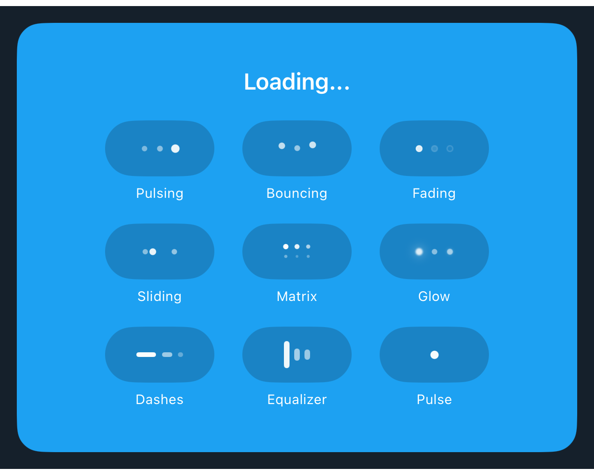

# DSLoadingIndicator

## Overview

`DSLoadingIndicator` renders compact animated loading affordances inspired by dot, dash, matrix, equalizer, and pulse states. It is suitable for inline progress chips, empty-state loading rows, and compact activity surfaces where a full `ProgressView` would feel too generic.

#### Initialization:
Initializes `DSLoadingIndicator` with a style, fixed capsule size, dot metrics, semantic tint, optional container color, and animation state.
- Parameters:
- `style`: One of the built-in `DSLoadingIndicatorStyle` cases.
- `width`: The indicator container width.
- `height`: The indicator container height.
- `dotSize`: The base size used by dots, dashes, and bars.
- `dotSpacing`: Spacing between repeated marks.
- `tint`: Semantic color token used for dots, dashes, and bars.
- `containerColor`: Optional semantic color token for the capsule background. Pass `nil` for an unframed indicator.
- `containerOpacity`: Opacity applied after resolving `containerColor` from the active DSKit appearance.
- `isAnimated`: Enables the live looping animation.

#### Usage:
Use `DSLoadingIndicator` when a screen needs a compact loading treatment that still follows DSKit colors and sizing. Previews can animate normally, while snapshot examples can disable animation for deterministic documentation.

## Example

```swift
struct Testable_DSLoadingIndicator: View {
    @Environment(\.appearance) private var appearance: DSAppearance
    @Environment(\.surfaceStyle) private var surfaceStyle: DSSurfaceStyle

    private let isAnimated: Bool
    private let columns = Array(repeating: GridItem(.fixed(84), spacing: 14), count: 3)

    init(isAnimated: Bool = false) {
        self.isAnimated = isAnimated
    }

    var body: some View {
        VStack(spacing: 18) {
            DSText("Loading...")
                .dsTextStyle(.headline, .text(.brandOnBold))

            LazyVGrid(columns: columns, spacing: 16) {
                ForEach(DSLoadingIndicatorStyle.allCases, id: \.self) { style in
                    VStack(spacing: 6) {
                        DSLoadingIndicator(
                            style: style,
                            tint: .icon(.brandOnBold),
                            containerColor: .background(.surfaceRaised),
                            containerOpacity: 0.22,
                            isAnimated: isAnimated,
                            staticPhase: style.snapshotPhase
                        )
                        .accessibilityLabel(Text(style.displayTitle))

                        DSText(style.displayTitle, alignment: .center)
                            .dsTextStyle(.caption1, .text(.brandOnBold))
                            .lineLimit(1)
                            .minimumScaleFactor(0.8)
                    }
                }
            }
        }
        .padding(.horizontal, 34)
        .padding(.vertical, 32)
        .background {
            DSColorToken.background(.brand)
                .color(for: appearance, in: surfaceStyle)
        }
        .clipShape(.rect(cornerRadius: 18))
    }
}
```

## Preview



## DSKitExplorer Usage

No direct `DSKitExplorer/Screens` usage was found.

## Related Components

[DSText](DSText.md)

## Reference

> Generated by `Scripts/documentation_generator.sh`. Edit the Swift source comment or generator instead of this file.

- Source: [DSKit/Sources/DSKit/Views/DSLoadingIndicator.swift](../../DSKit/Sources/DSKit/Views/DSLoadingIndicator.swift)
- Full usage map: [UsageIndex.md#dsloadingindicator](UsageIndex.md#dsloadingindicator)
- Explorer usage: 0 screen files
- Type: Component
- Snapshot: [DSLoadingIndicator.snapshot.png](../../DSKitTests/__Snapshots__/DSKitTests/DSLoadingIndicator.snapshot.png)
