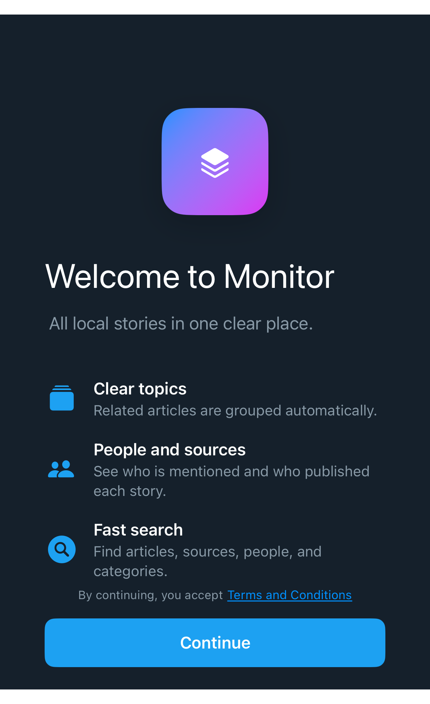

# DSOnboardingWelcomeView

## Overview

`DSOnboardingWelcomeView` provides an Apple-style first-run onboarding layout with a hero, concise headline, supporting subtitle, feature rows, one-line terms acceptance, and a bottom primary action.

#### Initialization:
Initializes the welcome layout with display copy, feature rows, legal link copy, actions, and hero content.
- Parameters:
- `headline`: Main welcome headline.
- `subtitle`: Supporting product description.
- `features`: Feature rows shown below the hero copy.
- `acceptanceNote`: Text before the terms link.
- `termsLinkTitle`: Link-styled legal text.
- `termsLinkAccessibilityHint`: Accessibility hint for the legal link.
- `ctaTitle`: Primary action title.
- `onTermsTap`: Legal link action.
- `onContinue`: Primary action.
- `hero`: App icon, illustration, or brand view.

#### Usage:
Use `DSOnboardingWelcomeView` when an app needs a compact first-run explanation. Keep copy and navigation in the app, and pass a DSKit-compatible hero such as `DSAppIconHeroView`.

## Example

```swift
struct Testable_DSOnboardingWelcomeView: View {
    var body: some View {
        DSOnboardingWelcomeView(
            headline: "Welcome to Monitor",
            subtitle: "All local stories in one clear place.",
            features: [
                DSOnboardingWelcomeFeature(
                    systemImage: "rectangle.stack.fill",
                    title: "Clear topics",
                    subtitle: "Related articles are grouped automatically."
                ),
                DSOnboardingWelcomeFeature(
                    systemImage: "person.2.fill",
                    title: "People and sources",
                    subtitle: "See who is mentioned and who published each story."
                ),
                DSOnboardingWelcomeFeature(
                    systemImage: "magnifyingglass.circle.fill",
                    title: "Fast search",
                    subtitle: "Find articles, sources, people, and categories."
                )
            ],
            acceptanceNote: "By continuing, you accept",
            termsLinkTitle: "Terms and Conditions",
            ctaTitle: "Continue",
            onTermsTap: {},
            onContinue: {},
            hero: {
                Testable_DSAppIconHeroView()
            }
        )
    }
}
```

## Preview



## DSKitExplorer Usage

No direct `DSKitExplorer/Screens` usage was found.

## Related Components

[DSAppIconHeroView](DSAppIconHeroView.md), [DSButton](DSButton.md), [DSImageView](DSImageView.md), [DSText](DSText.md)

## Reference

> Generated by `Scripts/documentation_generator.sh`. Edit the Swift source comment or generator instead of this file.

- Source: [DSKit/Sources/DSKit/Views/DSOnboardingWelcomeView.swift](../../DSKit/Sources/DSKit/Views/DSOnboardingWelcomeView.swift)
- Full usage map: [UsageIndex.md#dsonboardingwelcomeview](UsageIndex.md#dsonboardingwelcomeview)
- Explorer usage: 0 screen files
- Type: Component
- Snapshot: [DSOnboardingWelcomeView.snapshot.png](../../DSKitTests/__Snapshots__/DSKitTests/DSOnboardingWelcomeView.snapshot.png)
