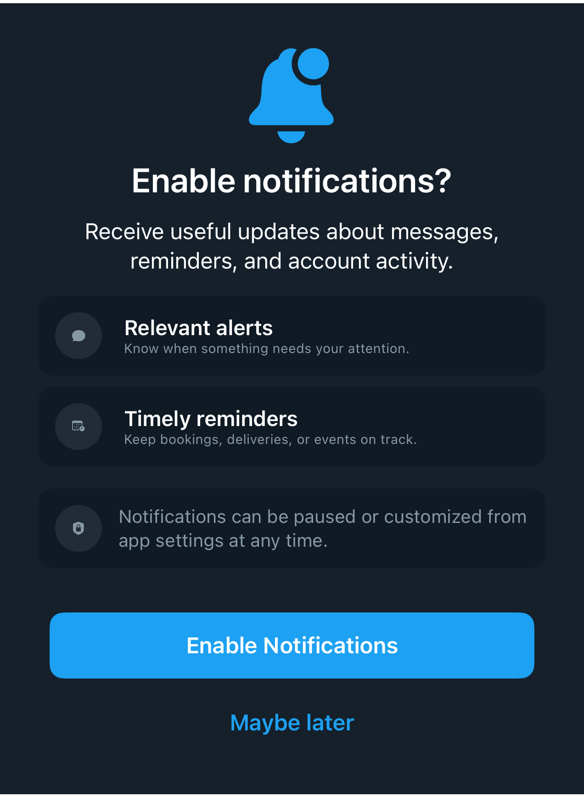

# DSPermissionPromptView

## Overview

`DSPermissionPromptView` renders a reusable pre-permission screen with a hero symbol, benefit cards, privacy/support note, primary action, and secondary action.

#### Initialization:
Initializes a permission prompt with display-ready permission copy.
- Parameters:
- `heroSystemName`: SF Symbol shown in the hero.
- `title`: Main permission question.
- `message`: Supporting explanation.
- `benefits`: Benefit rows shown as cards.
- `noteSystemName`: SF Symbol for the final note card.
- `note`: Privacy or settings note.
- `primaryTitle`: Primary action title.
- `secondaryTitle`: Secondary action title.
- `primaryAction`: Primary action.
- `secondaryAction`: Secondary action.

#### Usage:
Use `DSPermissionPromptView` before system permission dialogs. Keep OS authorization calls, navigation, and analytics in the host app; DSKit only renders the prompt and forwards actions.

## Example

```swift
struct Testable_DSPermissionPromptView: View {
    var body: some View {
        DSPermissionPromptView(
            heroSystemName: "bell.badge.fill",
            title: "Enable notifications?",
            message: "Receive useful updates about messages, reminders, and account activity.",
            benefits: [
                DSPermissionPromptBenefit(
                    systemName: "message.fill",
                    title: "Relevant alerts",
                    subtitle: "Know when something needs your attention."
                ),
                DSPermissionPromptBenefit(
                    systemName: "calendar.badge.clock",
                    title: "Timely reminders",
                    subtitle: "Keep bookings, deliveries, or events on track."
                )
            ],
            note: "Notifications can be paused or customized from app settings at any time.",
            primaryTitle: "Enable Notifications",
            secondaryTitle: "Maybe later",
            primaryAction: {},
            secondaryAction: {}
        )
    }
}
```

## Preview



## DSKitExplorer Usage

- [LocationPermissionScreen](../Screens/LocationPermissionScreen.md) ([source](../../DSKitExplorer/Screens/LocationPermissionScreen.swift))
- [NotificationsPermissionScreen](../Screens/NotificationsPermissionScreen.md) ([source](../../DSKitExplorer/Screens/NotificationsPermissionScreen.swift))
- [PhotosPermissionScreen](../Screens/PhotosPermissionScreen.md) ([source](../../DSKitExplorer/Screens/PhotosPermissionScreen.swift))

## Related Components

[DSButton](DSButton.md), [DSCardSurface](DSCardSurface.md), [DSEntityRow](DSEntityRow.md), [DSHStack](DSHStack.md), [DSImageView](DSImageView.md), [DSText](DSText.md), [DSVStack](DSVStack.md)

## Reference

> Generated by `Scripts/documentation_generator.sh`. Edit the Swift source comment or generator instead of this file.

- Source: [DSKit/Sources/DSKit/Views/DSPermissionPromptView.swift](../../DSKit/Sources/DSKit/Views/DSPermissionPromptView.swift)
- Full usage map: [UsageIndex.md#dspermissionpromptview](UsageIndex.md#dspermissionpromptview)
- Explorer usage: 3 screen files
- Type: Component
- Snapshot: [DSPermissionPromptView.snapshot.png](../../DSKitTests/__Snapshots__/DSKitTests/DSPermissionPromptView.snapshot.png)
