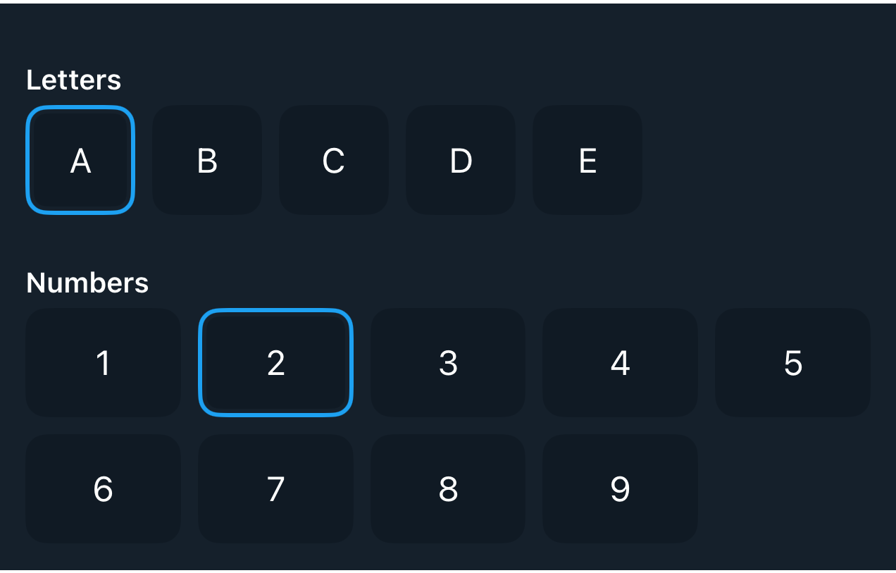

# DSPickerView

> Generated by `Scripts/documentation_generator.sh`. Edit the Swift source comment or generator instead of this file.

## Reference

- Source: [DSKit/Sources/DSKit/Views/DSPickerView.swift](../../DSKit/Sources/DSKit/Views/DSPickerView.swift)
- Full usage map: [UsageIndex.md#dspickerview](UsageIndex.md#dspickerview)
- Explorer usage: 6 screen files
- Snapshot: [DSPickerView.snapshot.png](../../DSKitTests/__Snapshots__/DSKitTests/DSPickerView.snapshot.png)

## Overview

`DSPickerView` is a versatile SwiftUI component within the DSKit framework, designed to present selectable content in various styles such as a horizontal scroll or a grid. It offers a dynamic way to select items from a collection, adapting to different content layouts based on user preferences or UI requirements.

#### Styles:
The `Style` enum defines how the items are presented:
- `horizontalScroll`: Items are displayed in a horizontally scrolling list.
- `grid(columns: Int)`: Items are arranged in a grid with a specified number of columns.

#### Initialization:
Initializes a `DSPickerView` with customization options for layout and interaction.
- Parameters:
- `style`: The visual layout style of the picker.
- `data`: The collection of data items.
- `id`: KeyPath to the unique identifier for each data item.
- `selected`: A `Binding` to the currently selected data element.
- `content`: Closure that generates a view for each item.

#### Usage:
`DSPickerView` is ideal for applications requiring user selection from a set of options displayed either in a line or a matrix.

## Example

```swift
struct Testable_DSPickerView: View {

    let letters = ["A", "B", "C", "D", "E"]
    @State var selectedLetter = "A"

    let numbers = ["1", "2", "3", "4", "5", "6", "7", "8", "9"]
    @State var selectedNumber = "2"

    var body: some View {
        DSVStack {
            DSPickerView(
                data: letters,
                id: \.self,
                selected: $selectedLetter,
                content: { element in
                    DSText(element)
                        .dsSize(20)
                        .dsCardStyle()
                }
            ).dsSectionStyle(title: "Letters")

            DSPickerView(
                style: .grid(columns: 5),
                data: numbers, id: \.self,
                selected: $selectedNumber,
                content: { element in
                    DSText(element)
                        .frame(maxWidth: .infinity)
                        .dsCardStyle()
                }
            ).dsSectionStyle(title: "Numbers")
        }
    }
}
```

## Snapshot



## DSKitExplorer Usage

- [DSKitExplorer/Screens/Filters2.swift](../../DSKitExplorer/Screens/Filters2.swift)
- [DSKitExplorer/Screens/Filters3.swift](../../DSKitExplorer/Screens/Filters3.swift)
- [DSKitExplorer/Screens/ItemDetails2.swift](../../DSKitExplorer/Screens/ItemDetails2.swift)
- [DSKitExplorer/Screens/ItemDetails3.swift](../../DSKitExplorer/Screens/ItemDetails3.swift)
- [DSKitExplorer/Screens/ItemDetails4.swift](../../DSKitExplorer/Screens/ItemDetails4.swift)
- [DSKitExplorer/Screens/ItemDetails5.swift](../../DSKitExplorer/Screens/ItemDetails5.swift)

## Related Components

[DSGrid](DSGrid.md), [DSHScroll](DSHScroll.md), [DSText](DSText.md), [DSVStack](DSVStack.md)
