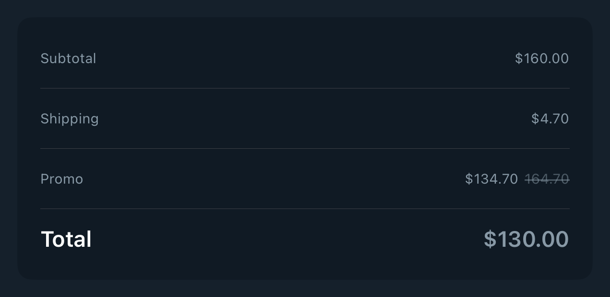

# DSPriceSummaryList

## Overview

`DSPriceSummaryList` renders checkout, order, shipping, or billing totals as a grouped list of price rows. It centralizes the repeated DSKitExplorer pattern of label/value rows with a visually emphasized total row.

#### Initialization:
Initializes `DSPriceSummaryList` with a collection of `DSPriceSummaryItem` values.
- Parameters:
- `items`: Display-ready rows containing a title, price, and optional emphasis flag.
- `rowHeight`: Optional fixed row height for compact summaries.

#### Usage:
Use `DSPriceSummaryList` for totals and adjustments after a screen has already mapped domain values into display-ready `DSPriceSummaryItem` rows. Keep tax, discount, and business calculations outside the component.

## Example

```swift
struct Testable_DSPriceSummaryList: View {
    private let items = [
        DSPriceSummaryItem(title: "Subtotal", price: DSPrice(amount: "160.00", currency: "$")),
        DSPriceSummaryItem(title: "Shipping", price: DSPrice(amount: "4.70", currency: "$")),
        DSPriceSummaryItem(
            title: "Promo",
            price: DSPrice(amount: "134.70", regularAmount: "164.70", currency: "$")
        ),
        DSPriceSummaryItem(
            title: "Total",
            price: DSPrice(amount: "130.00", currency: "$"),
            isEmphasized: true
        )
    ]

    var body: some View {
        DSPriceSummaryList(items: items)
    }
}
```

## Preview



## DSKitExplorer Usage

- [Order1](../Screens/Order1.md) ([source](../../DSKitExplorer/Screens/Order1.swift))
- [Order2](../Screens/Order2.md) ([source](../../DSKitExplorer/Screens/Order2.swift))
- [Shipping2](../Screens/Shipping2.md) ([source](../../DSKitExplorer/Screens/Shipping2.swift))

## Related Components

[DSGroupedList](DSGroupedList.md), [DSKeyValueRow](DSKeyValueRow.md)

## Reference

> Generated by `Scripts/documentation_generator.sh`. Edit the Swift source comment or generator instead of this file.

- Source: [DSKit/Sources/DSKit/Views/DSPriceSummaryList.swift](../../DSKit/Sources/DSKit/Views/DSPriceSummaryList.swift)
- Full usage map: [UsageIndex.md#dspricesummarylist](UsageIndex.md#dspricesummarylist)
- Explorer usage: 3 screen files
- Type: Component
- Snapshot: [DSPriceSummaryList.snapshot.png](../../DSKitTests/__Snapshots__/DSKitTests/DSPriceSummaryList.snapshot.png)
