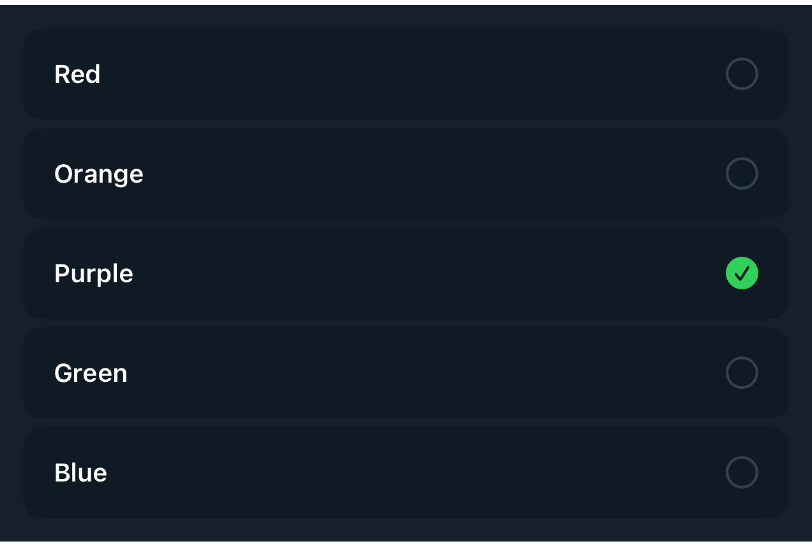

# DSRadioPickerView

## Overview

`DSRadioPickerView` is a SwiftUI component designed to offer a customizable radio button selection interface within the DSKit framework. It allows users to select a single option from a list of available options, making it ideal for forms, surveys, and settings.

#### Initialization:
Initializes a `DSRadioPickerView` with data and custom content rendering options.
- Parameters:
- `data`: The collection of data items.
- `id`: KeyPath to the unique identifier for each data item.
- `selected`: A `Binding` to the currently selected data element.
- `content`: Closure that generates a view for each item, provided with selection status.

#### Interaction:
- Tapping an item updates the selection state, accompanied by haptic feedback to enhance user interaction.

#### Usage:
`DSRadioPickerView` is suitable for scenarios where users need to make a single selection from multiple options, such as choosing a color, selecting a configuration option, or setting preferences.

## Example

```swift
struct Testable_DSRadioPickerView: View {
    let data = ["Red", "Orange", "Purple", "Green", "Blue"]
    @State var selected = "Purple"
    var body: some View {
        DSRadioPickerView(data: data, id: \.self, selected: $selected, content: { element, _ in
            DSText(element).dsTextStyle(DSTypographyToken.label)
        })
    }
}
```

## Preview



## DSKitExplorer Usage

- [Filters1](../Screens/Filters1.md) ([source](../../DSKitExplorer/Screens/Filters1.swift))
- [Filters2](../Screens/Filters2.md) ([source](../../DSKitExplorer/Screens/Filters2.swift))
- [Payment1](../Screens/Payment1.md) ([source](../../DSKitExplorer/Screens/Payment1.swift))
- [Shipping1](../Screens/Shipping1.md) ([source](../../DSKitExplorer/Screens/Shipping1.swift))
- [Shipping2](../Screens/Shipping2.md) ([source](../../DSKitExplorer/Screens/Shipping2.swift))

## Related Components

[DSImageView](DSImageView.md), [DSText](DSText.md), [DSVStack](DSVStack.md)

## Reference

> Generated by `Scripts/documentation_generator.sh`. Edit the Swift source comment or generator instead of this file.

- Source: [DSKit/Sources/DSKit/Views/DSRadioPickerView.swift](../../DSKit/Sources/DSKit/Views/DSRadioPickerView.swift)
- Full usage map: [UsageIndex.md#dsradiopickerview](UsageIndex.md#dsradiopickerview)
- Explorer usage: 5 screen files
- Type: Component
- Snapshot: [DSRadioPickerView.snapshot.png](../../DSKitTests/__Snapshots__/DSKitTests/DSRadioPickerView.snapshot.png)
