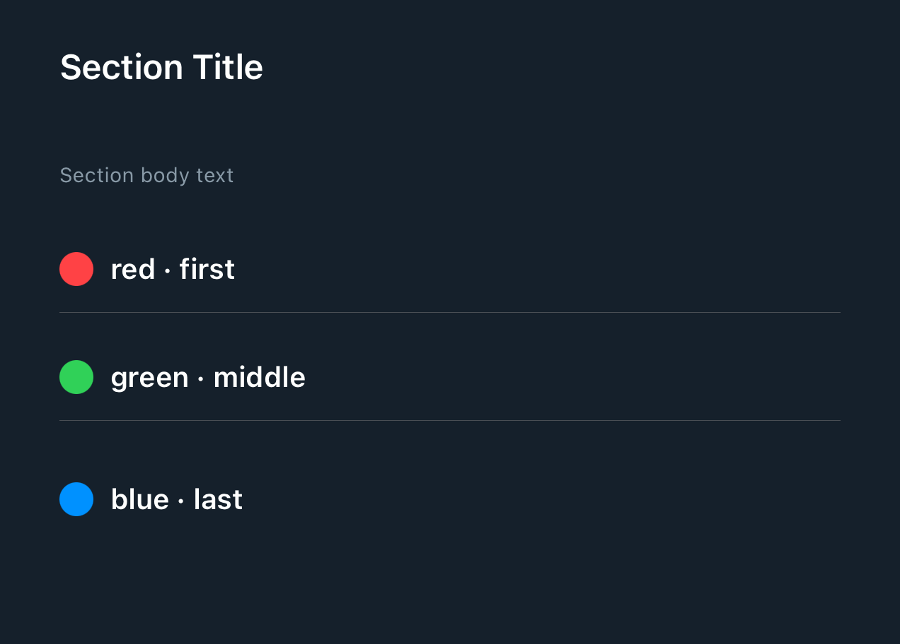

# DSSection

## Overview

`DSSection` wraps SwiftUI's `Section` and applies DSKit list styling, background, and content margins.

Use the plain initializer for arbitrary section content:
- `DSSection(content:)`
- Override row spacing for a subtree with `.dsSpacing(...)`

Use the data-driven initializers when the section renders repeated list rows and DSKit should own
row position and separator boilerplate:
- `DSSection(data:id:content:)`
- `DSSection(data:id:nativeSeparator:content:)`
- `DSSection(data:id:content:separator:)`

When section content contains many vertical rows, emit the `ForEach` rows directly instead of
wrapping the whole set in `VStack` or `LazyVStack`, or SwiftUI may collapse them into one large
list cell.

## Example

```swift
struct Testable_DSSection: View {
    private let colors: [DSSectionPreviewColor] = [
        DSSectionPreviewColor(title: "red", color: .red),
        DSSectionPreviewColor(title: "green", color: .green),
        DSSectionPreviewColor(title: "yellow", color: .yellow),
        DSSectionPreviewColor(title: "purple", color: .purple)
    ]

    var body: some View {
        DSList(spacing: .custom(12)) {
            DSSection {
                DSVStack(spacing: .space4) {
                    DSText("Section Title").dsTextStyle(.headline)
                    DSText("Section body text").dsTextStyle(.caption2)
                }
            }

            DSSection(
                data: colors,
                id: \.title,
                nativeSeparator: .visible
            ) { item, position in
                DSHStack {
                    Circle()
                        .fill(item.color)
                        .frame(width: 16, height: 16)

                    DSText("\(item.title) · \(String(describing: position))")
                        .dsTextStyle(.headline)
                }
            }

            DSSection(
                data: colors,
                id: \.title,
                content: { item, _ in
                    DSText(item.title)
                        .dsTextStyle(.headline)
                },
                separator: { _ in
                    DSDivider(style: .dots())
                }
            )
            .dsSpacing(.space4)
        }
    }
}
```

## Preview



## DSKitExplorer Usage

- [AboutUsScreen1](../Screens/AboutUsScreen1.md) ([source](../../DSKitExplorer/Screens/AboutUsScreen1.swift))
- [AboutUsScreen2](../Screens/AboutUsScreen2.md) ([source](../../DSKitExplorer/Screens/AboutUsScreen2.swift))
- [BookingScreen1](../Screens/BookingScreen1.md) ([source](../../DSKitExplorer/Screens/BookingScreen1.swift))
- [BookingScreen2](../Screens/BookingScreen2.md) ([source](../../DSKitExplorer/Screens/BookingScreen2.swift))
- [BookingScreen3](../Screens/BookingScreen3.md) ([source](../../DSKitExplorer/Screens/BookingScreen3.swift))
- [BookingScreen4](../Screens/BookingScreen4.md) ([source](../../DSKitExplorer/Screens/BookingScreen4.swift))
- [BookingScreen5](../Screens/BookingScreen5.md) ([source](../../DSKitExplorer/Screens/BookingScreen5.swift))
- [CartScreen1](../Screens/CartScreen1.md) ([source](../../DSKitExplorer/Screens/CartScreen1.swift))
- [CartScreen2](../Screens/CartScreen2.md) ([source](../../DSKitExplorer/Screens/CartScreen2.swift))
- [CartScreen3](../Screens/CartScreen3.md) ([source](../../DSKitExplorer/Screens/CartScreen3.swift))
- See [UsageIndex.md#dssection](UsageIndex.md#dssection) for 44 more references.

## Related Components

[DSDivider](DSDivider.md), [DSHStack](DSHStack.md), [DSList](DSList.md), [DSText](DSText.md), [DSVStack](DSVStack.md)

## Reference

> Generated by `Scripts/documentation_generator.sh`. Edit the Swift source comment or generator instead of this file.

- Source: [DSKit/Sources/DSKit/Views/DSSection.swift](../../DSKit/Sources/DSKit/Views/DSSection.swift)
- Full usage map: [UsageIndex.md#dssection](UsageIndex.md#dssection)
- Explorer usage: 54 screen files
- Type: Primitive
- Snapshot: [DSSection.snapshot.png](../../DSKitTests/__Snapshots__/DSKitTests/DSSection.snapshot.png)
