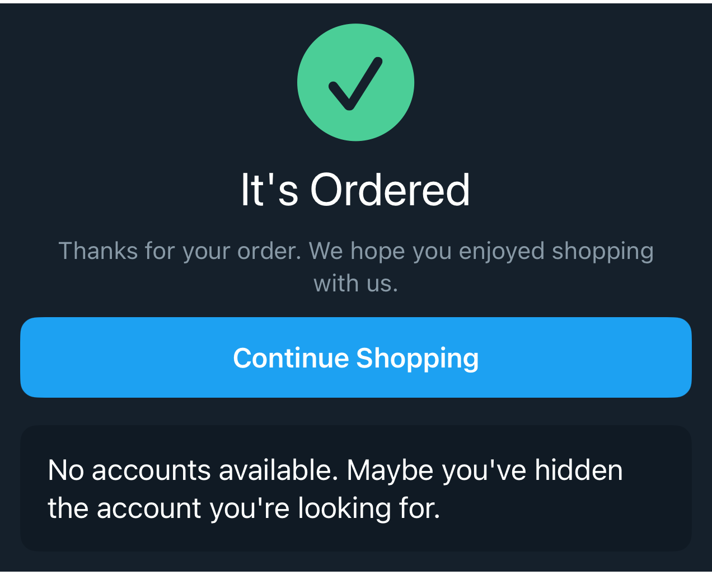

# DSStatusView

## Overview

`DSStatusView` is a reusable success, empty, permission, or informational state. It supports an optional SF Symbol, title, message, action, and either plain centered presentation or a compact card presentation.

#### Initialization:
Initializes `DSStatusView` with optional status content and styling.
- Parameters:
- `systemName`: Optional SF Symbol shown above the text.
- `title`: Optional status title.
- `message`: Optional supporting message.
- `style`: `.plain` for centered screen states or `.card` for compact message cards.
- `alignment`: Horizontal content alignment.
- `textAlignment`: Text alignment for title and message.
- `actionTitle`: Optional button title.
- `action`: Optional button action.

#### Usage:
Use `DSStatusView` for confirmation states, empty lists, permission prompts, or compact single-message cards. When no icon or title is provided, `.card` keeps vertical and horizontal padding balanced for simple empty messages.

## Example

```swift
struct Testable_DSStatusView: View {
    var body: some View {
        DSVStack(spacing: .space16) {
            DSStatusView(
                systemName: "checkmark.circle.fill",
                title: "It's Ordered",
                message: "Thanks for your order. We hope you enjoyed shopping with us.",
                actionTitle: "Continue Shopping",
                action: {}
            )

            DSStatusView(
                message: "No accounts available. Maybe you've hidden the account you're looking for.",
                style: .card,
                alignment: .leading,
                textAlignment: .leading,
                messageStyle: .bodyLarge
            )
        }
    }
}
```

## Preview



## DSKitExplorer Usage

- [Order3](../Screens/Order3.md) ([source](../../DSKitExplorer/Screens/Order3.swift))
- [Order4](../Screens/Order4.md) ([source](../../DSKitExplorer/Screens/Order4.swift))

## Related Components

[DSButton](DSButton.md), [DSImageView](DSImageView.md), [DSText](DSText.md), [DSVStack](DSVStack.md)

## Reference

> Generated by `Scripts/documentation_generator.sh`. Edit the Swift source comment or generator instead of this file.

- Source: [DSKit/Sources/DSKit/Views/DSStatusView.swift](../../DSKit/Sources/DSKit/Views/DSStatusView.swift)
- Full usage map: [UsageIndex.md#dsstatusview](UsageIndex.md#dsstatusview)
- Explorer usage: 2 screen files
- Type: Component
- Snapshot: [DSStatusView.snapshot.png](../../DSKitTests/__Snapshots__/DSKitTests/DSStatusView.snapshot.png)
